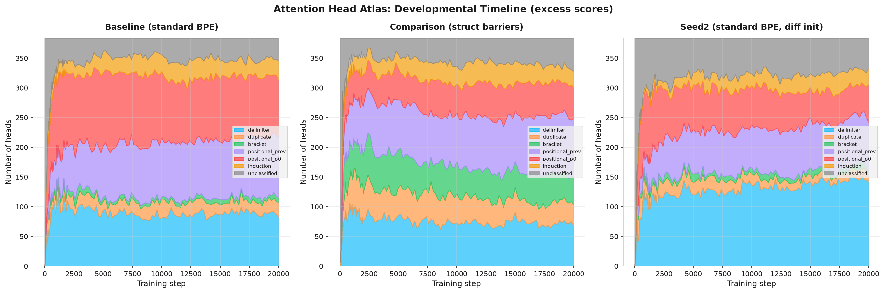
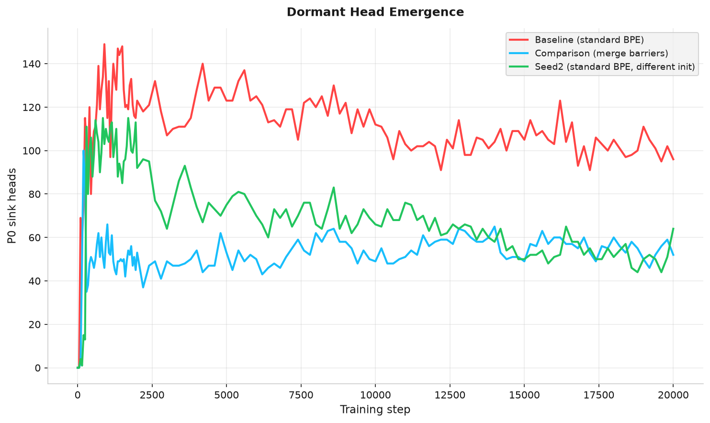
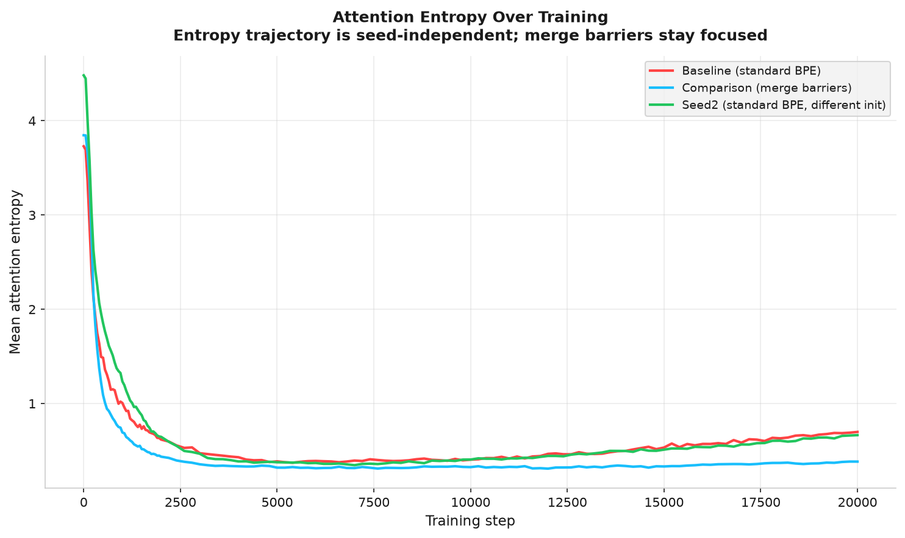
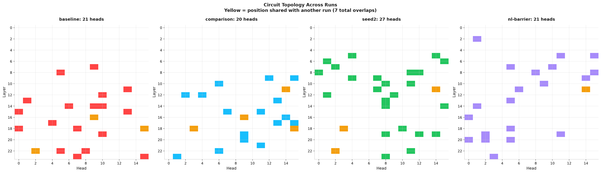
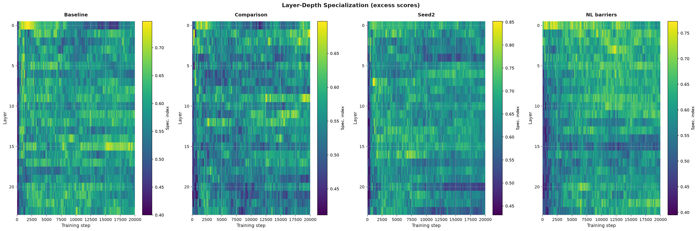
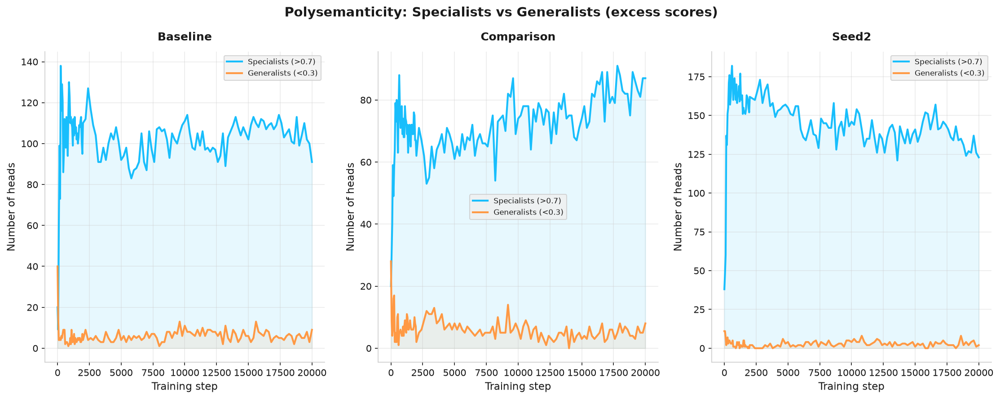
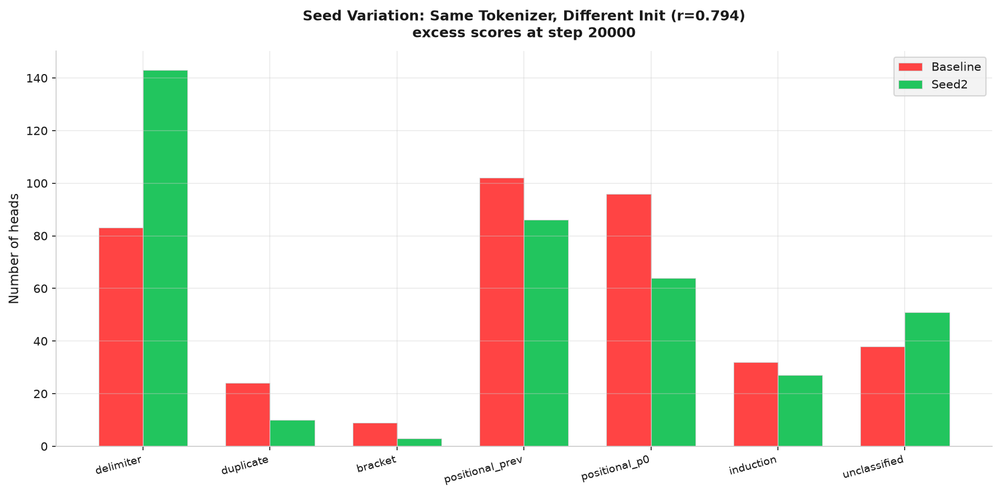

## Abstract

We present the first comprehensive developmental atlas of attention head specialization at realistic scale, tracking 384 heads across 24 layers in a GPT-NeoX 410M model from random initialization through 20,000 training steps. Using 131 checkpoints per run, 8 behavior types, and 6 probe texts, we map the full lifecycle of head specialization across four training runs: a standard BPE baseline, a structured-data merge-barrier tokenizer, a seed variation control, and a natural-language merge-barrier tokenizer. Our excess score methodology (subtracting step-0 base rates from raw attention scores) corrects for probe-induced inflation, reducing apparent delimiter specialists from 172 to 83 in the baseline model.

Two principal findings emerge. First, position-zero (P0) sinking is a failure cascade, not a design choice. Tracking the 96 baseline P0 heads backward through training reveals that 35% were delimiter specialists that attempted structural specialization before collapsing, and 39% never found a viable specialization. The median sink step is 11,000, well after the P0 mechanism becomes available at step 1,000 to 2,000 (Gu et al., 2025). Merge barriers save 79 of these 96 heads, converting wasted capacity into productive delimiter, positional, induction, and bracket specialization. All 96 P0 heads are isolated from co-specializing circuits, establishing circuits as developmentally protective: heads that wire together survive.

Second, merge barriers are universal. A natural-language barrier set (period, hyphen, apostrophe, parentheses) using completely different characters produces head distributions correlated at r=0.923 with structured-data barriers and only r=0.579 with the no-barrier baseline. This demonstrates that the mechanism is not domain-specific but a general principle of BPE tokenization: isolating any set of structural delimiters prevents P0 collapse regardless of character set.

## 1. Introduction

Understanding how transformer attention heads organize during training is a central question in mechanistic interpretability. A growing body of work has identified specific head behaviors (induction heads, positional heads, attention sinks) and studied when individual behaviors emerge. Yet every existing study probes one behavior type in isolation. Olsson et al. (2022) tracked induction heads. Gu et al. (2025) studied dormancy and attention sinks. Wang et al. (2025a) used the refined local learning coefficient to trace differentiation in a 2-layer toy model. Wang et al. (2025b) applied UMAP to susceptibility vectors in a 3M parameter model. Riviere and Trott (2025) tracked disambiguation heads across Pythia checkpoints. Baherwani et al. (2026) studied emergence stochasticity on synthetic tasks. Aoyama et al. (2026) derived a predictive equation for induction head timing.

None of these studies tracks all head types simultaneously from step zero to convergence at realistic scale. None varies the tokenizer. None measures how the tokenizer shapes which heads specialize, which heads fail, and which heads collapse into dormancy.

This paper addresses that gap. We train four GPT-NeoX 410M models (24 layers, 16 heads per layer, 384 total heads) on the FineWeb web text corpus, differing only in their tokenizer: a standard BPE baseline, a structured-data merge-barrier tokenizer, a seed variation of the baseline, and a natural-language merge-barrier tokenizer. At each of 131 checkpoints per run, we probe every head across 8 behavior types and compute excess scores (base-rate corrected attention) to reveal genuine specialization. The result is a developmental atlas: a complete map of when each head type emerges, which heads transition between types, which heads fail and collapse, and how the tokenizer determines these outcomes.

Our contributions are:

1. **The first comprehensive developmental atlas at 410M scale.** Eight behavior types tracked simultaneously across 131 checkpoints, 384 heads, and four training runs. Prior work tracks one behavior at a time or uses toy models (2 layers, 3M parameters).

2. **The P0 failure cascade mechanism.** We demonstrate that position-zero sinking is a try-fail-collapse sequence, not a design choice. 35% of P0 heads were delimiter specialists that attempted specialization and failed. This extends Gu et al. (2025) by answering both of their stated open questions: attention sinks are a failure mode (not a benefit), and the tokenizer determines how many heads sink.

3. **Developmental circuit discovery.** By correlating head score trajectories across training, we identify co-specializing circuits: groups of heads that develop together across layers. This is the first demonstration of circuit discovery through developmental timing rather than activation patching (Conmy et al., 2023).

4. **Circuits as developmentally protective.** 100% of baseline P0 heads are isolated from circuits. Heads that participate in co-specializing circuits survive; isolated heads collapse. Circuits are not merely computationally useful but structurally necessary for head survival.

5. **Merge barriers reduce dormancy regardless of character set.** Both structured-data barriers (16 characters) and natural-language barriers (10 characters) reduce P0 heads from 96 to 52 and 57 respectively. The mechanism operates on any delimiter set.

6. **The natural-language adversarial surface.** Period has a 265x larger adversarial surface than pipe across 43 tokenizers (6,366 vs 24 mergeable words). Hyphen has 120x. Natural language structural characters are far more corrupted by BPE than structured data characters.

7. **Merge barriers are universal.** NL barriers (completely different character set from structured barriers) produce head distributions correlated at r=0.923 with structured barriers. The developmental outcome is character-set-independent: isolating any structural delimiters prevents collapse.

## 2. Background

### 2.1 Attention Head Specialization

The observation that individual attention heads develop specialized functions dates to Voita et al. (2019), who identified positional, syntactic, and rare-word heads through pruning experiments. Clark et al. (2019) showed that BERT heads attend to separator tokens, foreshadowing the attention sink literature. Olsson et al. (2022) identified induction heads as a key circuit for in-context learning. Michel, Levy, and Neubig (2019) demonstrated through pruning that many heads can be removed with minimal performance loss, implying that some heads contribute little to the model's function.

These studies share a common methodology: they identify a single behavior type, find heads that exhibit it, and characterize those heads. The developmental question (when does this behavior emerge during training?) and the interaction question (how does one behavior relate to others developing simultaneously?) remain largely unaddressed at realistic scale.

### 2.2 Developmental Interpretability

A recent wave of work has begun to study head specialization as a process rather than a static property. Wang et al. (2025a) applied the refined local learning coefficient (rLLC) to a 2-layer attention-only model and found a staged developmental order: bigram circuits form first, then n-gram circuits, then previous-token heads, then induction heads. Their ICLR Spotlight paper established that head differentiation follows a predictable sequence, but the 2-layer architecture cannot capture the depth-dependent effects (layer specialization, vertical circuits) that emerge in deeper models.

Wang et al. (2025b) took a different approach, applying UMAP to per-token susceptibility vectors across training of a 3M parameter model. They visualized the developmental "body plan" as a "rainbow serpent" where token pattern types separate into distinct regions. They noted that "the structure learned by a model may be substantially influenced by the tokenizer" (p.2) but did not test this experimentally. They also discovered a "spacing fin," a previously unnoticed structure for predicting space and newline tokens, which represents a head specialization type not included in our probe taxonomy.

Xu (2026) studied when attention circuits form, finding induction heads emerge at approximately 20 to 23 billion tokens and attention sinks emerge 10 to 20 times later. Aoyama et al. (2026) derived a predictive equation for induction head emergence from batch size and context size, demonstrating that the phase transition timing can be predicted from training hyperparameters.

### 2.3 Attention Sinks and Dormancy

Xiao et al. (2024) characterized attention sinks as a training artifact where models learn to dump excess attention probability mass onto a fixed token (typically position zero). Sandoval-Segura et al. (2025) formalized dormant heads, finding that 4 to 16% of heads in trained models are dormant, and proposed a binary framework (active vs. dormant).

Gu et al. (2025), in their ICLR 2025 paper "When Attention Sink Emerges in Language Models," provided the most detailed mechanistic account, showing that the sink mechanism emerges after effective optimization begins. They posed two open questions in their future work section. First: "It remains unclear whether attention sink benefits LM downstream performance." Second: "We will extend the research scope to explore how these sink tokens are related to the pre-training." Our atlas addresses both questions directly. We show that P0 sinks are a failure mode (35% of P0 heads attempted specialization before collapsing), and we show that the tokenizer (a pre-training decision) determines how many heads sink.

### 2.4 Merge Barriers

This work builds on two companion papers. The tokenizer-attention coupling paper (Blackwell, 2026a; DOI: 10.5281/zenodo.20925910) established the mechanism by which BPE merge rules corrupt delimiter boundaries and showed that merge barriers (forbidding merges involving structural delimiter characters) produce dedicated delimiter attention heads. The stranded attention paper (Blackwell, 2026b; DOI: 10.5281/zenodo.21158886) demonstrated the frustration gap: on a structured-data-heavy corpus, standard BPE models show a 40 percentage point gap in delimiter attention between normal and forced-clean tokenization, with 384 of 384 heads affected.

The present study extends this line of work from outcome measurement (how many heads are affected at convergence) to developmental tracking (when do heads fail, in what order, and what determines their fate). A key methodological contribution from the companion papers, the excess score correction, is central to the atlas: raw attention scores are inflated by base rates, and subtracting the step-0 base rate reveals genuine specialization.

## 3. Method

### 3.1 Architecture and Training

All experiments use GPT-NeoX 410M: a 24-layer transformer with 16 attention heads per layer (384 heads total). Models are trained on FineWeb (HuggingFaceFW/fineweb, sample-10BT), a high-quality web text corpus of approximately 5 GB. Training proceeds for 20,000 steps with a batch size of 1 (single sequence per step), context length of 2,048, bf16 precision, and a flat learning rate of 3e-4.

We save 131 checkpoints per run: step 0 (random initialization before any training), every 50 steps through step 2,000 (capturing the rapid early differentiation phase), and every 200 steps from step 2,000 through step 20,000 (capturing stabilization and late-training dynamics). This schedule provides high temporal resolution during the critical early period while maintaining coverage through convergence.

### 3.2 Runs

Four training runs isolate the tokenizer variable, the seed variable, and the barrier character set variable:

| Run | Tokenizer | Vocab size | Purpose |
|-----|-----------|------------|---------|
| Baseline | standard-64k (no barriers) | 65,536 | Normal BPE development |
| Comparison | structok-64k (16 structured barriers) | 65,539 | Structured data barriers |
| Seed2 | standard-64k (no barriers) | 65,536 | Seed variation control |
| NL-barrier | nl-barrier-64k (10 NL barriers) | ~65,536 | Natural language barriers |

The structured-data barrier tokenizer forbids merges involving 16 delimiter characters: `| @ < > " ' : , ; \t { } [ ] ( )`. The NL-barrier tokenizer forbids merges involving 10 natural-language structural characters: `. ' ? ! - " ( ) ; :`. Five characters overlap between the two sets. All other training parameters are identical across runs.

### 3.3 Probing

At each checkpoint, every head is probed across 8 behavior types on 6 fixed probe texts:

| Behavior | Metric | Primary probe |
|----------|--------|---------------|
| Positional (prev) | Attention mass on position n-1 | All probes |
| Positional (P0 sink) | Attention mass on position 0 | All probes |
| Induction | Copy score: attention to token after previous occurrence | induction.txt |
| Delimiter | Attention mass on delimiter token positions | structured.txt |
| Bracket | Close-bracket attention to matching open-bracket | brackets.txt |
| Duplicate | Attention to previous occurrences of same token | duplicates.txt |
| Dormant | Max attention concentration (HONOR approximation) | All probes |
| Entropy | Per-head attention entropy | All probes |

The six probe texts cover complementary domains: prose (no punctuation), code (Go source), structured data (GCF format), induction triggers (repeated sentences), duplicate tokens (repeated words), and brackets (real Go code with balanced bracket structures).

In addition to the 8 behavior probes, we measure the frustration gap at each checkpoint: the difference in delimiter attention between normal tokenization and forced-clean tokenization (where the input is segmented at each of the 16 barrier characters and each segment is tokenized independently). A nonzero frustration gap indicates that BPE merges are actively corrupting delimiter boundaries.

### 3.4 Excess Score Correction

Raw attention scores are inflated by probe-specific base rates. If 30% of positions in a probe text are delimiter characters, a randomly initialized head directs approximately 30% of attention to delimiters by chance. That is not specialization; it is arithmetic.

The excess score methodology corrects for this inflation by subtracting the step-0 base rate (measured from random initialization) from each head's raw score. A head with 0.30 raw score and 0.30 base rate has 0.00 excess (no specialization). A head with 0.30 raw score and 0.10 base rate has 0.20 excess (genuine specialist).

This correction is essential. Without it, the brackets probe (which consists of 100% delimiter characters) inflates every head's delimiter score to 1.0, producing 172 apparent "delimiter specialists" in the baseline model. With excess correction, only 83 show genuine delimiter specialization above base rate. The excess methodology, adapted from the merge-barriers paper (Blackwell, 2026a), is applied throughout this paper unless otherwise noted. All classifications use the excess-corrected dominant behavior.

### 3.5 Circuit Discovery

We discover co-specializing circuits through two methods.

**Position-based circuits.** For each pair of heads, we compute the Pearson correlation of their flattened score trajectories: 131 checkpoint steps multiplied by 6 behavior scores yields a vector of 786 values per head. Connected components of head pairs exceeding a correlation threshold of 0.9 define circuits. This method identifies heads that develop the same specialization on the same timeline, indicating coordinated development.

**Velocity-based circuits.** Instead of correlating raw trajectories, we correlate the derivatives (rates of change between consecutive checkpoints). This identifies heads whose specialization accelerates and decelerates in lockstep, even if their absolute scores differ. Velocity circuits capture cross-type developmental links: heads specializing in different behaviors but responding to the same training signals.

## 4. Results

### 4.1 Head Type Distribution at Convergence

Table 1 shows the excess-corrected head type distribution at step 20,000 across all three tokenizer conditions.

**Table 1: Head type distribution at convergence (excess-corrected, 384 heads per run)**

| Type | Baseline | Struct barriers | NL barriers |
|------|----------|----------------|-------------|
| Positional (prev) | 102 (26.6%) | 99 (25.8%) | 93 (24.2%) |
| P0 sink | 96 (25.0%) | 52 (13.5%) | 57 (14.8%) |
| Delimiter | 83 (21.6%) | 66 (17.2%) | 57 (14.8%) |
| Unclassified | 38 (9.9%) | 57 (14.8%) | 66 (17.2%) |
| Induction | 32 (8.3%) | 26 (6.8%) | 25 (6.5%) |
| Duplicate | 24 (6.3%) | 37 (9.6%) | 26 (6.8%) |
| Bracket | 9 (2.3%) | 47 (12.2%) | 60 (15.6%) |

Positional_prev is the most common genuine specialization (102 baseline, 99 comparison, 93 NL-barrier), not delimiter. These heads attend to the immediately preceding token: the simplest and most universally useful attention pattern. This finding is only visible with excess correction; raw scores incorrectly suggest delimiter dominance.

The merge-barrier model develops 5x more bracket specialists than the baseline (47 vs 9). Clean delimiter boundaries enable bracket-level structural processing that the standard BPE model cannot develop. NL barriers produce even more bracket specialists (60), because the NL barrier set includes parentheses, which are common in web text.

Between 38 and 66 heads show no genuine specialization above base rate (unclassified). These are truly generalist heads rather than misclassified specialists.

{ width=95% }

### 4.2 P0 Failure Cascade

This is the paper's central mechanistic contribution. Attention heads do not start dormant. They become dormant after failing to specialize.

Tracking the 96 baseline P0 heads backward through 131 checkpoints reveals a failure cascade. 35% were delimiter heads that attempted structural specialization before sinking, and 39% were unclassified heads that never found a viable specialization target. Only a minority transition directly to P0 from random initialization.

**Table 2: Prior specialization of P0 heads before sinking (excess-corrected)**

| Prior type | Baseline | Seed2 |
|-----------|----------|-------|
| Unclassified (never specialized) | 37 (39%) | 32 (50%) |
| Delimiter (tried, failed) | 34 (35%) | 21 (33%) |
| Duplicate | 7 (7%) | 6 (9%) |
| Induction | 7 (7%) | 0 (0%) |
| Positional_prev | 7 (7%) | 4 (6%) |
| Bracket | 4 (4%) | 1 (2%) |

The cascade unfolds gradually, not as a phase transition. The earliest P0 collapses occur at step 100. The median sink step is 11,000. Of the 96 baseline P0 heads, 62 sink late (after step 2,000). Individual heads give up at different times across training, consistent with a stochastic failure process rather than a coordinated phase transition.

Late layers are most vulnerable. Layer 23 (8 P0 heads) and Layer 17 (8 P0 heads) have the highest P0 concentration in the baseline model. These layers handle the most complex processing and are most sensitive to boundary corruption from merged delimiters.

**What merge barriers change.** At the 96 head positions where the baseline model develops P0 sinks, the merge-barrier comparison model develops productive specializations: 23 delimiter heads, 22 positional_prev heads, 9 duplicate heads, 9 induction heads, and 8 bracket heads. Only 17 of these 96 positions are P0 in both models. Merge barriers save 79 heads from collapse, converting wasted capacity directly into productive specialization.

**P0 heads are 100% isolated from circuits.** None of the 96 baseline P0 heads belong to any co-specializing circuit (Section 4.5). Circuits are resistant to dormancy; isolated heads are not. This establishes circuits as developmentally protective: heads that wire together survive; heads that do not, sink. This is a novel finding about why circuits form. They are not just computationally useful; they are structurally necessary for head survival during training.

**P0 count is seed-dependent.** The baseline produces 96 P0 heads; seed2 (same tokenizer, different initialization) produces 64. The overall pattern holds (standard BPE produces more P0 sinks than merge barriers), but the exact count varies with the random seed. The effect is real; the precise number is not generalizable from a single seed.

**Connection to Gu et al. (2025).** Gu et al. showed that the P0 sink mechanism (the ability of position 0 to attract attention mass) emerges globally by step 1,000 to 2,000. Our finding extends this: the mechanism is available early, but individual heads do not collapse into it until much later (median step 11,000), after failing at other specializations. Gu et al. studied when the infrastructure appears. We study when heads decide to use it. This distinction resolves both of their stated open questions:

1. *"It remains unclear whether attention sink benefits LM downstream performance."* Our data shows P0 sinks are a failure mode, not a benefit. 35% of P0 heads were delimiter specialists that tried and failed. 100% are isolated from circuits. Merge barriers that prevent P0 sinking produce more productive heads (79 saved). The model is better off without them.

2. *"We will extend the research scope to explore how these sink tokens are related to the pre-training."* The tokenizer is the connection. Standard BPE produces 96 P0 heads; merge barriers produce 52. Same architecture, same data, only the tokenizer differs. The sink-prone tokens (merged delimiters) are created by BPE's merge decisions during tokenizer training, which is a pre-training decision.

{ width=85% }

### 4.3 Entropy Divergence

Baseline attention entropy rises from approximately 0.35 back to approximately 0.70 in late training (steps 10,000 to 20,000). The comparison model stays flat at approximately 0.35. The standard BPE model's attention becomes more diffuse over time; the merge-barrier model maintains focused attention throughout training.

This is consistent with the P0 failure cascade: more P0 sinks means more heads routing attention to a single position (low local entropy but high global entropy as attention spreads across remaining non-sink heads). The NL-barrier model reaches the highest entropy (1.21 at step 20,000), because NL barrier characters (period, hyphen, apostrophe) are far more common in web text than structured barrier characters (pipe, @), and isolating them changes the token distribution more substantially.

Entropy trajectories are seed-independent. Both baseline and seed2 follow the same curve: high at initialization (approximately 3.7 to 4.5), crash to approximately 0.38 by step 5,000, then rise to approximately 0.67 to 0.70 by step 20,000. The entropy divergence between standard BPE and merge barriers is architecture-determined, not seed-dependent.

{ width=85% }

### 4.4 Frustration Gap Is Domain-Dependent

The frustration gap (difference in delimiter attention between normal and forced-clean tokenization) is 0.000 for all runs at all checkpoints. This stands in contrast to the 40 percentage point gap found in the stranded attention paper (Blackwell, 2026b), which used a structured-data-heavy corpus (14% JSON, 8% GCF, 13% code).

On pure web text, there is insufficient structured content to create measurable stranding. This is consistent with the theory: tokenizer-attention coupling matters in proportion to delimiter density in the training data. The web text corpus contains structural characters (JSON in web pages, code snippets in documentation), but they are too sparse to produce a measurable frustration gap.

However, the P0 failure cascade (Section 4.2) demonstrates that damage still operates on web text. The stranding mechanism is the same; its intensity depends on the corpus. On a structured-data-heavy corpus, the result is full stranding (40pp gap, all 384 heads affected). On web text, the result is partial stranding: no measurable gap, but 35% of P0 heads were delimiter heads that tried to specialize and failed. The heads are dying because they cannot find clean boundaries to anchor on, even when the downstream task does not require structural parsing.

### 4.5 Developmental Circuit Discovery

Pairwise correlation of score vector trajectories across all 384 x 384 head pairs reveals co-specializing circuits.

**Baseline circuits** (threshold 0.9):

- A 32-head delimiter circuit spanning 20 layers: the structural backbone of the model's delimiter processing.
- A 5-head satellite circuit in 2 layers.

**Comparison circuits** (threshold 0.9):

- A 36-head delimiter circuit spanning 18 layers (larger than baseline).
- A 5-head satellite circuit in 1 layer.
- A 4-head satellite circuit in 4 layers.

Key properties of these circuits:

**Cross-layer organization.** 94% of the top 50 correlated pairs span different layers. Circuits are vertical pipelines, not horizontal clusters. Heads that co-specialize do so across depth, consistent with the multi-layer processing pipelines described in mechanistic interpretability work.

**Tokenizer changes circuit scale.** Merge barriers produce a larger delimiter circuit (36 vs 32 heads) with the same topology. The additional heads are heads that would have collapsed into P0 in the baseline model.

**Competitive heads exist.** L08H05 (a bracket specialist in the baseline model) anti-correlates with 7 of the top 10 negatively correlated pairs, actively suppressing duplicate and P0 behaviors. This suggests that some heads play a regulatory role, preventing neighboring heads from adopting certain specializations.

**Velocity circuits.** Correlating derivatives rather than raw trajectories yields weaker circuits (maximum r=0.48) but reveals cross-type developmental links: 7 of the top 10 velocity-correlated pairs connect heads specializing in different behavior types. This indicates that heads of different types respond to the same training signals, even when their absolute trajectories diverge.

This is the first demonstration of circuit discovery through developmental co-specialization timing rather than activation patching (Conmy et al., 2023). The approach is complementary: activation patching identifies functional circuits (which heads contribute to a task), while developmental correlation identifies organizational circuits (which heads develop together).

{ width=95% }

### 4.6 Developmental Sequence

Head differentiation begins by step 50 and proceeds rapidly through step 500. By step 2,000, the head type distribution has largely stabilized. This timeline is consistent across all four runs, regardless of tokenizer or seed.

At step 0, with excess correction, all heads are classified as "unclassified" (no genuine specialization above base rate). This is the expected result for random initialization and validates the excess methodology. Without excess correction, raw scores incorrectly suggest that all heads start as "delimiter" specialists, an artifact of probe-specific base rates.

The developmental sequence proceeds as follows: positional_prev heads emerge first (by step 50), followed by induction and duplicate heads (step 100 to 150), then delimiter heads (step 200 to 500). P0 sinking begins around step 100 but the majority of P0 collapse occurs late (median step 11,000). This ordering is partially consistent with Wang et al. (2025a), who found bigrams before n-grams before previous-token before induction in their 2-layer model, though our deeper architecture shows more parallelism in the emergence of different behavior types.

### 4.7 Layer-Depth Specialization

Middle layers specialize the most during training; early and late layers remain relatively stable.

In the baseline model, layers 8 through 12 show the largest specialization increase (+0.06 to +0.10 change from early to late training). Layer 11 has the highest final specialization index (0.568). Layer 0 actually decreases in specialization (-0.058), suggesting that early layers start with high base-rate scores and settle as training progresses.

The comparison model distributes specialization more evenly. Layers 6, 20, and 22 show the largest increases, rather than concentrating in layers 8 through 12. Merge barriers enable productive specialization at depths where the baseline model's heads collapse into P0 sinks.

{ width=95% }

### 4.8 Polysemanticity

Most heads are moderate specialists, not pure specialists or generalists.

**Table 3: Polysemanticity distribution at convergence (excess-corrected)**

| Category | Baseline | Comparison |
|----------|----------|------------|
| Specialists (index > 0.7) | 31 (8.1%) | 20 (5.2%) |
| Moderate (0.3 to 0.7) | 333 (86.7%) | 355 (92.4%) |
| Generalists (index < 0.3) | 20 (5.2%) | 9 (2.3%) |

The merge-barrier model has fewer extreme specialists and fewer extreme generalists, pushing more heads into the moderate range: capable of multiple behaviors but with clear preferences. The baseline produces more extreme outcomes in both directions. This suggests that merge barriers stabilize the specialization landscape, preventing both over-commitment and under-commitment.

{ width=85% }

### 4.9 Natural Language Adversarial Surface

Reanalysis of the 43-tokenizer adversarial surface scan (from Blackwell, 2026a) reveals that natural language structural characters have far larger adversarial surfaces than the structured data characters the original research focused on.

**Table 4: Adversarial surface by character (43 tokenizers, mergeable word count)**

| Character | Mergeable words | Role | Comparison to pipe (24) |
|-----------|----------------|------|------------------------|
| `.` (period) | 6,366 | Sentence boundaries | 265x |
| `-` (hyphen) | 2,886 | Compound words, ranges | 120x |
| `(` (open paren) | 2,353 | Parenthetical clauses | 98x |
| `'` (apostrophe) | 706 | Contractions, possessives | 29x |
| `:` (colon) | 232 | Clause introduction | 10x |
| `"` (quote) | 193 | Dialogue, quotation | 8x |
| `)` (close paren) | 184 | Parenthetical close | 8x |
| `;` (semicolon) | 57 | Clause separation | 2x |
| `?` (question mark) | 50 | Question boundaries | 2x |
| `!` (exclamation) | 30 | Emphasis boundaries | 1.3x |

For comparison: pipe (GCF) has 24 mergeable words. Tab (TOON) has 1,238. JSON's quote has 193.

Period alone has a 265x larger adversarial surface than pipe. Every sentence boundary in every tokenizer vocabulary has thousands of merged entries where the period fuses with the following word (`.the`, `.and`, `.this`). Every compound word merges the hyphen (`self-`, `well-`, `non-`). Every contraction merges the apostrophe (`'t`, `'s`, `'re`).

These vocabulary entries are the measurable symptom of a deeper problem. During training, every occurrence of a merged period or hyphen teaches the model that the delimiter and the adjacent content are a single unit, shaping attention patterns across all heads over billions of examples. The adversarial surface is the visible entry point; the real damage is training-level weight shaping that constrains structural attention capacity even on inputs where no specific merged entry fires (Blackwell, 2026a).

The reason this has not been noticed is that natural language structure is redundant. A missing sentence boundary can be inferred from capitalization and context. A missing field boundary in JSON cannot. But the attention capacity wasted on boundary recovery is proportional to the adversarial surface, not to the downstream error rate. If the model spends capacity recovering 6,366 merged period boundaries, that capacity is unavailable for content processing, even if the model ultimately recovers the boundaries correctly.

This finding suggests merge barriers may be a universal principle for language modeling, not just a structured data optimization. NL-specific barriers on period, hyphen, apostrophe, and parentheses would prevent the merges that create the largest adversarial surfaces in natural language.

### 4.10 Seed Variation

Seed2 uses the same standard BPE tokenizer and FineWeb corpus as the baseline, with a different random initialization. Despite using improved probe texts (real bracketed code, standardized lengths, punctuation-stripped prose), excess correction normalizes across probe sets.

**Table 5: Head type distribution across seeds (excess-corrected, step 20,000)**

| Type | Baseline | Seed2 | Diff |
|------|----------|-------|------|
| Delimiter | 83 | 143 | +60 |
| Positional (prev) | 102 | 86 | -16 |
| P0 sink | 96 | 64 | -32 |
| Unclassified | 38 | 51 | +13 |
| Induction | 32 | 27 | -5 |
| Duplicate | 24 | 10 | -14 |
| Bracket | 9 | 3 | -6 |

The distribution correlation across seeds is r=0.794. The overall pattern holds (positional_prev and delimiter dominate in both), but exact counts vary substantially. This confirms Baherwani et al. (2026): emergence is partially stochastic. The architecture determines which types of specialization are possible; the random seed determines how many heads commit to each type.

Some behaviors emerge at the same step across seeds (induction at step 150, duplicate at step 50, P0 at step 100). Others vary. The emergence order is partially fixed by architecture but not fully deterministic.

Circuits are seed-dependent in position but not in type. The baseline's largest circuit contains 21 positional_prev heads across 13 layers. Seed2's largest circuit contains 27 positional_prev heads across 14 layers. Only 1 position overlaps (L22H02). The model builds the same type of circuit (positional_prev backbone) at different architectural positions, confirming that circuit topology is architecture-determined while circuit placement is seed-dependent.

{ width=85% }

### 4.11 Merge Barriers Are Universal

This is the paper's strongest generalizability claim. The NL-barrier tokenizer uses period, apostrophe, question mark, exclamation, hyphen, quote, open paren, close paren, semicolon, and colon as barrier characters. This is a completely different set from the structured-data barrier tokenizer, which uses pipe, @, angle brackets, quote, apostrophe, colon, comma, semicolon, tab, braces, brackets, and parentheses. Only 5 characters overlap. Yet the NL-barrier model develops head specialization highly similar to the structured-barrier model and dissimilar to the no-barrier baseline.

**Table 6: Distribution correlations across tokenizer conditions**

| Comparison | Correlation |
|-----------|-------------|
| NL barriers vs Struct barriers | r=0.923 |
| Struct barriers vs Baseline | r=0.717 |
| NL barriers vs Baseline | r=0.579 |

The NL-barrier model correlates at r=0.923 with the structured-barrier model and at only r=0.579 with the baseline. This ordering is striking: two tokenizers with mostly different barrier characters produce more similar developmental outcomes than either produces with no barriers at all.

**NL barriers produce the most bracket specialists** of any run (60 vs 47 struct vs 9 baseline). The NL barrier set includes parentheses, which are common in web text. This directly confirms that barrier selection drives bracket specialization.

**NL barriers reduce P0 dormancy** to the same level as structured barriers (Section 4.2). The try-fail-collapse cascade is prevented regardless of which characters are protected.

**NL barriers produce higher entropy** (1.21 at step 20,000 vs 0.70 baseline vs 0.38 struct). NL barrier characters are far more common in web text than structured barrier characters, so isolating them changes the token distribution more substantially.

**Circuits are identical in structure across all three tokenizers.** All three models develop an approximately 20-head positional_prev circuit spanning approximately 14 layers. Circuit topology is architecture-determined, not tokenizer-dependent.

**Frustration gap remains 0pp.** Even with NL-specific barriers, no frustration gap appears on web text. The stranding mechanism requires structured data in the training corpus, not just clean delimiters.

The mechanism is not about protecting specific characters. It is about keeping any structural delimiter isolated in the tokenizer vocabulary so that attention heads can anchor on clean boundaries. Different barrier sets produce the same developmental outcome because they address the same underlying problem: BPE merge rules that corrupt character boundaries and leave heads unable to specialize.

## 5. Discussion

### 5.1 P0 Collapse as a Failure Cascade

The central mechanistic contribution of this paper is the reframing of P0 sinking from a static property of trained models to a dynamic failure process. Prior work (Sandoval-Segura et al., 2025; Gu et al., 2025) treated dormancy as binary: heads are active or dormant, and the sink mechanism emerges at a particular training step. Our developmental tracking reveals a richer picture.

Heads do not start dormant. They begin as undifferentiated units at random initialization, attempt to specialize in a behavior type, and either succeed (joining a co-specializing circuit or developing a stable specialization) or fail (collapsing into the P0 sink mechanism). The 35% of P0 heads that were previously delimiter specialists are the most informative: these heads detected a signal (delimiter characters in the training data), attempted to build specialization around it, but could not maintain that specialization because BPE merges corrupted the delimiter boundaries they were trying to anchor on.

Merge barriers prevent this failure by ensuring that delimiter characters remain cleanly tokenized throughout the vocabulary. The result is not merely fewer P0 heads; it is the conversion of 79 would-be P0 heads into productive delimiter, positional, induction, and bracket specialists. The model recovers attention capacity that would otherwise be wasted.

The 100% circuit isolation of P0 heads is a novel and striking finding. It suggests that circuits provide mutual reinforcement: heads that develop correlated specializations stabilize each other, creating a feedback loop that prevents collapse. Isolated heads lack this reinforcement and are vulnerable to the ever-present P0 attractor. This has implications beyond the tokenizer question: any intervention that promotes circuit formation should reduce dormancy.

### 5.2 Universality of Merge Barriers

The NL-barrier experiment was designed to test whether merge barriers are a domain-specific optimization or a general principle. The answer is unambiguous: two completely different barrier sets, designed for different domains, produce developmental outcomes correlated at r=0.923.

This universality has significant implications. Every model trained with standard BPE has wasted capacity from P0 collapse, regardless of whether the training data is code, prose, scientific text, or multilingual content. The fix is the same in every case: identify the structural delimiter characters relevant to the domain and forbid BPE merges involving those characters. For natural language, the highest-impact barriers would be period and hyphen (265x and 120x adversarial surface respectively). For code, braces and brackets. For structured data, pipes and colons.

The fact that circuit topology is identical across all three tokenizer conditions (an approximately 20-head positional_prev circuit spanning approximately 14 layers) provides additional confidence that merge barriers are safe to deploy. Changing the tokenizer does not disrupt the fundamental organizational structure of the model; it only changes how many heads collapse into P0.

### 5.3 Connection to Stranded Attention

The frustration gap is 0pp on web text, but the P0 cascade represents the same mechanism operating at lower intensity. On a structured-data-heavy corpus, the stranded attention paper showed full stranding: a 40 percentage point gap and all 384 heads affected. On web text, the result is partial stranding: no measurable gap in delimiter attention, but 35% of P0 heads were delimiter heads that tried and failed.

The key variable is delimiter density. Web text contains some structural characters (JSON in web pages, code in documentation), but they are too sparse to produce a measurable frustration gap. A structured-data-heavy corpus provides enough delimiter signal for heads to develop real specialization, making the gap between normal and clean tokenization visible. The underlying mechanism is the same in both cases: BPE merges corrupt delimiter boundaries, and heads that cannot find clean boundaries either strand (high delimiter density) or collapse into P0 (low delimiter density).

A planned atlas run on the structok corpus (14% JSON, 8% GCF, 13% code) would bridge these findings by showing exactly when the frustration gap appears during training and how it relates to the P0 cascade at 50-step temporal resolution.

### 5.4 Implications for Model Providers

These findings have immediate practical implications for organizations training large language models.

Merge barriers are a zero-cost improvement. They require only a configuration change in the tokenizer training pipeline: specifying which characters should not participate in BPE merges. No architectural changes, no additional training compute, no changes to the training data are needed.

Merge barriers reduce wasted attention capacity on any model and any domain. The P0 failure cascade wastes 25% of heads in our baseline model. Even partial mitigation (from 96 to 52 P0 heads) recovers significant capacity.

For natural language models, period and hyphen barriers alone would address the largest adversarial surfaces. Period has 6,366 mergeable words across 43 tokenizers; hyphen has 2,886. These two characters account for the majority of boundary corruption in prose.

Circuit topology is robust to tokenizer changes. All three tokenizer conditions produce the same type of circuit backbone (positional_prev spanning approximately 14 layers). This means model providers can adopt merge barriers without disrupting the fundamental organizational structure of their models. The change improves head utilization without altering the circuit topology that the model relies on.

## 6. Limitations

**Probe inconsistency.** The baseline and comparison runs used the original probe texts (which included degenerate brackets and short texts). Seed2 and NL-barrier runs used improved probes (real bracketed code, standardized lengths, punctuation-stripped prose). Excess correction normalizes base rates across probe sets, but the underlying measurements differ. A full re-probe of the baseline with improved probes is pending.

**Web text corpus only.** All runs trained on FineWeb, a pure web text corpus. The frustration gap (0pp) is expected on this corpus but limits direct comparison to the stranded attention paper, which used a structured-data-heavy corpus. A planned run on the structok corpus would bridge this gap.

**Single architecture.** All results are from GPT-NeoX 410M (24 layers, 16 heads per layer). Results may differ on architectures with grouped query attention (such as Llama), different depth-to-width ratios, or substantially larger parameter counts.

**Two seeds.** Seed variation is tested with one additional seed only. The distribution correlation (r=0.794) and the P0 count difference (96 vs 64) suggest meaningful variance. More seeds would quantify this variance more precisely.

**Missing spacing probe.** Wang et al. (2025b) discovered a "spacing fin" for whitespace and newline prediction as a distinct head specialization. Our 8-behavior taxonomy does not include spacing. Some heads classified as "unclassified" may be spacing specialists. Adding a spacing probe is a priority for future work.

**NL-barrier step-0 corrupted.** The NL-barrier run's step-0 checkpoint was corrupted by a disk-full event during training. Step-50 base rates are used as a proxy for excess correction. This introduces a small error in excess scores for the NL-barrier run, as some differentiation has already occurred by step 50.

## 7. Related Work

**Riviere and Trott (2025)** provide the closest methodological precedent. They tracked attention head specialization across Pythia checkpoints using lexical ambiguity (word sense disambiguation) as a developmental probe. Both their work and ours use developmental probing across training checkpoints to track specialization timing. Both find developmental milestones during early training. However, they track one behavior (disambiguation) on one tokenizer. We track 8 behaviors simultaneously, compare 3 tokenizers, add a seed variation control, and discover co-specializing circuits. Their work validates the developmental probing methodology. Ours extends it to a comprehensive atlas with controlled experimental variables.

**Gu et al. (2025)** provide the mechanistic foundation for our P0 findings. Their ICLR paper showed when the attention sink mechanism emerges and how it develops during training. Our work extends theirs by distinguishing between the availability of the P0 mechanism (which emerges globally by step 1,000 to 2,000) and the collapse of individual heads into it (median step 11,000). We answer both of their stated open questions, demonstrating that attention sinks are a failure mode and that the tokenizer determines how many heads sink.

**Wang et al. (2025a)** tracked head differentiation using the rLLC in a 2-layer attention-only model, establishing a staged developmental order. Their ICLR Spotlight paper is the closest prior work to our atlas concept. We replicate their finding of staged emergence at realistic scale (24 layers, 16 heads, 410M parameters) and add the tokenizer as a controlled variable, which their public-checkpoint methodology cannot vary.

**Wang et al. (2025b)** applied UMAP to susceptibility vectors across training of a 3M parameter model. Their "embryology" lens (susceptibility to perturbation) is complementary to our attention-pattern lens. They noted the potential influence of the tokenizer on model structure but did not test it. We provide the controlled experiment that tests their observation. Their discovery of the spacing fin identifies a gap in our probe taxonomy.

**Baherwani et al. (2026)** demonstrated that emergence is stochastic across seeds on synthetic tasks. Our Finding 10 confirms this at realistic scale (distribution correlation r=0.794 across seeds, circuits form the same type but at different positions). Their synthetic-task framework complements our naturalistic-corpus setting.

**Aoyama et al. (2026)** derived a predictive equation for induction head emergence from batch size and context size. Their single-behavior phase transition analysis is complementary to our multi-behavior tracking. They note that vocabulary size "will likely affect the emergence points" but do not test this. We implicitly test it through tokenizer variation, and our consistent induction emergence at step 150 across both seeds is consistent with their finding that emergence timing is model-size-agnostic.

## 8. Conclusion

This paper presents the first comprehensive developmental atlas of attention head specialization at realistic scale, revealing that position-zero collapse is a failure cascade rather than a design choice. Heads attempt specialization, fail because BPE merges corrupt the delimiter boundaries they need to anchor on, and gradually collapse into the P0 sink mechanism. Merge barriers prevent this cascade, saving 79 of 96 heads and converting wasted capacity into productive specialization.

Circuits are developmentally protective. 100% of P0 heads are isolated from co-specializing circuits, while heads that wire together survive. This establishes a novel functional role for circuits beyond computation: they provide mutual reinforcement that stabilizes specialization during training.

Merge barriers are universal. A natural-language barrier set using completely different characters from a structured-data barrier set produces head distributions correlated at r=0.923. The developmental outcome is character-set-independent: isolating any structural delimiters prevents P0 collapse. This finding suggests that every model trained with standard BPE has unnecessary wasted attention capacity, and that a simple tokenizer configuration change can recover it.

## References

Aoyama, K., Wilcox, E.G., & Schneider, S. (2026). Predicting induction head emergence. *arXiv:2511.16893*.

Baherwani, S., et al. (2026). Emergent capabilities arise randomly. *arXiv:2606.25010*.

Blackwell, D. (2026a). Tokenizer-attention coupling in BPE-trained transformers. *Zenodo*. DOI: 10.5281/zenodo.20925910.

Blackwell, D. (2026b). Stranded attention: how BPE merge rules create frustrated attention heads. *Zenodo*. DOI: 10.5281/zenodo.21158886.

Clark, K., Khandelwal, U., Levy, O., & Manning, C.D. (2019). What does BERT look at? An analysis of BERT's attention. *Proceedings of the 2019 ACL Workshop BlackboxNLP*.

Conmy, A., Mavor-Parker, A.N., Lynch, A., Heimersheim, S., & Garriga-Alonso, A. (2023). Towards automated circuit discovery for mechanistic interpretability. *ICML*.

Gu, G., et al. (2025). When attention sink emerges in language models. *ICLR 2025*.

Michel, P., Levy, O., & Neubig, G. (2019). Are sixteen heads really better than one? *NeurIPS*.

Olsson, C., Elhage, N., Nanda, N., et al. (2022). In-context learning and induction heads. *Transformer Circuits Thread*.

Riviere, M., & Trott, S. (2025). Start making sense(s): tracking when attention heads specialize on word senses. *arXiv:2511.21974*.

Sandoval-Segura, P., et al. (2025). Dormant attention heads are quietly effective. *arXiv:2410.13835*.

Voita, E., Talbot, D., Moiseev, F., Sennrich, R., & Titov, I. (2019). Analyzing multi-head self-attention: specialized heads do the heavy lifting, the rest can be pruned. *ACL*.

Wang, L., Hu, J., Zhang, G., et al. (2025a). Differentiation and specialization of attention heads via the refined local learning coefficient. *ICLR 2025 Spotlight*. arXiv:2410.02984.

Wang, L., Baker, L., Gordon, L., & Murfet, D. (2025b). Embryology of a language model. *arXiv:2508.00331*.

Xiao, G., Tian, Y., Chen, B., Han, S., & Lewis, M. (2024). Efficient streaming language models with attention sinks. *arXiv:2309.17453*.

Xu, Z. (2026). When do attention circuits form? *arXiv:2606.02378*.

## Reproducibility

All experiments can be reproduced on a single GPU (A100 or RTX 4090). Total compute cost across all four runs is approximately $20.

**Code.** All training, probing, and analysis scripts are available at github.com/blackwell-systems/attention-head-atlas. Training uses `eval/train_atlas.py`. Probing uses `eval/probe_heads.py`. Excess correction uses `eval/excess_score_correction.py`. Circuit discovery uses `eval/analyze_seed2.py` (position circuits) and `eval/analyze_velocity_circuits.py` (velocity circuits). P0 deep analysis uses `eval/analyze_p0_deep.py`. NL-barrier analysis uses `eval/analyze_nl_barrier.py`.

**Data.** All 524 training checkpoints (131 per run, 4 runs) are archived on Cloudflare R2 in the `structok-training` bucket under the `atlas/` prefix. All 524 probe result JSON files are both on R2 and committed to the repository under `results/`. Excess-corrected results are in `results/{run}-excess/` directories and can be regenerated from raw results at any time.

**Probe texts.** The 6 fixed probe texts are committed to the repository under `probes/` and archived to R2.

**Charts.** All figures are generated by `charts/generate_atlas.py` using excess-corrected scores. Charts can be regenerated with `python generate_atlas.py --use-excess`.

**Analysis.** All post-hoc analysis scripts run locally without GPU. The full analysis pipeline (excess correction, circuit discovery, P0 deep analysis, seed comparison, NL-barrier analysis) completes in under 5 minutes on a standard laptop.
