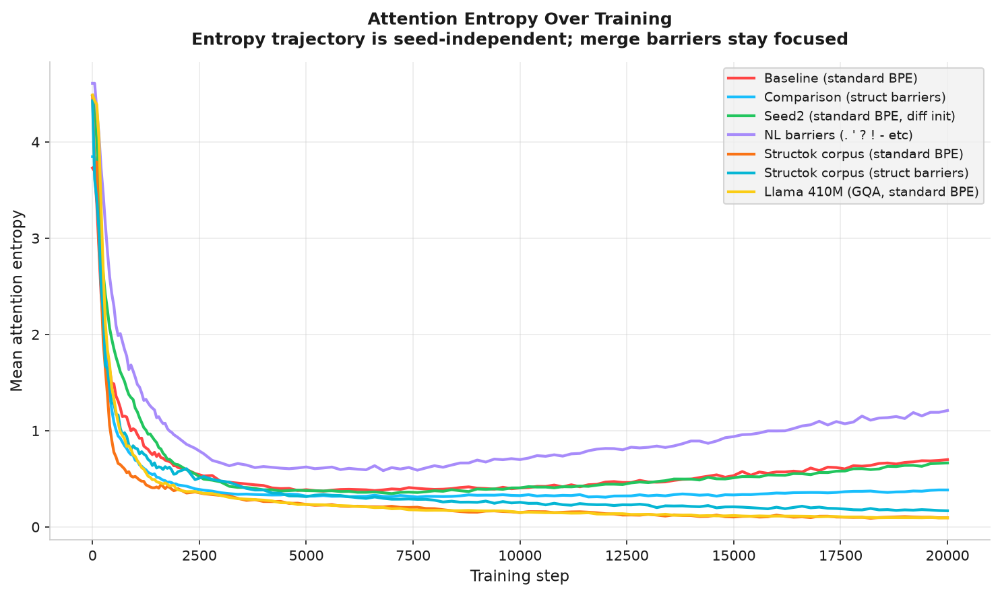
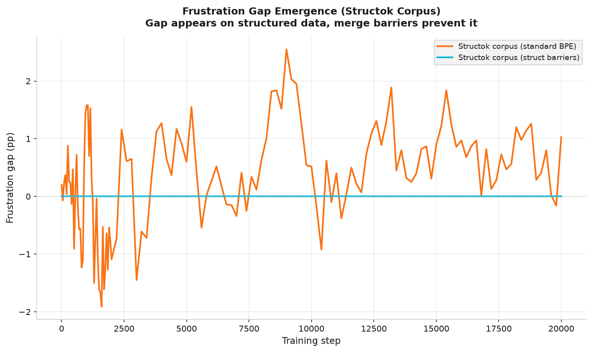
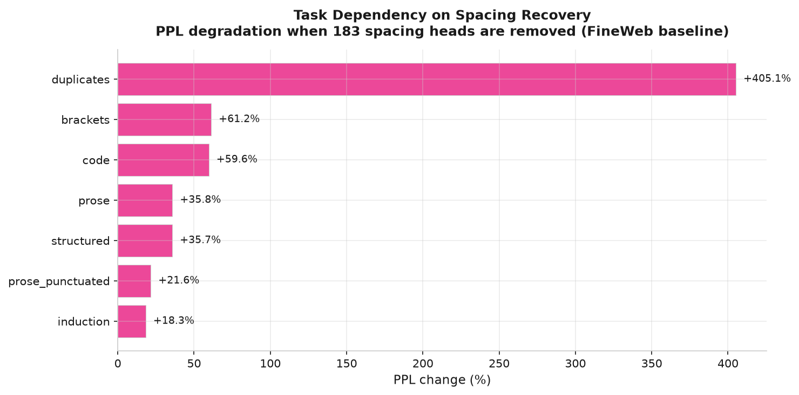
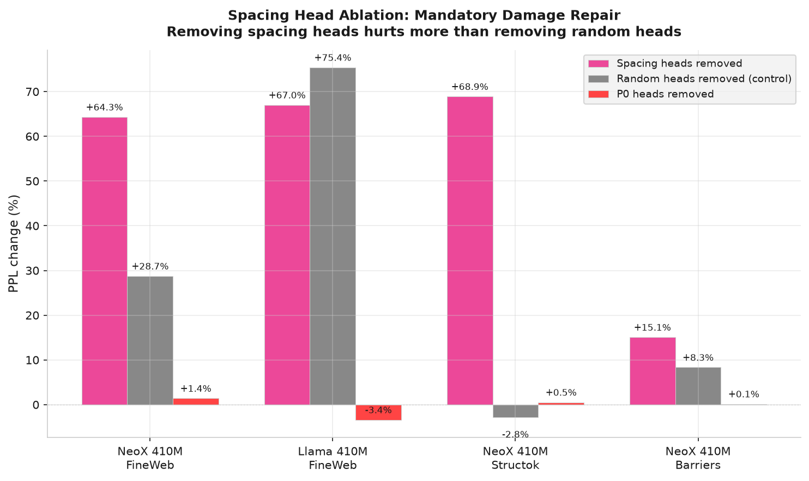

## Abstract

Approximately half of all attention heads in standard BPE models are consumed by mandatory whitespace boundary recovery. Removing these heads degrades performance by +64%, proving the recovery is essential, but merge barriers (a 16-line tokenizer configuration change) eliminate the need for it entirely. An additional 8% of heads collapse into position-zero sinks that contribute nothing (confirmed by ablation: +1.4% change when removed). Together, over half of attention capacity in standard BPE is non-productive.

We establish these findings through a developmental atlas: the first comprehensive tracking of attention head specialization at realistic scale, covering 384 heads across 7 behavior types, 131 checkpoints per run, and six training runs on two corpora (GPT-NeoX 410M). Our excess score methodology (subtracting step-0 base rates) corrects for probe-induced inflation, and causal ablation validates the observational findings.

Three principal results. In our 410M models, 183 of 384 heads (47.7%) become spacing specialists, dedicating capacity to whitespace boundary recovery. Ablation proves this recovery is essential (+64% degradation when removed), but merge barriers eliminate the need for it entirely (0 spacing heads with NL barriers). This is a capacity tax, not a design choice: the model is forced to repair damage that BPE inflicts on whitespace boundaries. The count is deterministic across seeds, confirming the "spacing fin" prediction of Wang et al. (2025b) at 410M scale.

Second, position-zero (P0) sinking is a failure cascade, and ablation provides the first causal proof that P0 heads contribute nothing to model performance (+1.4% PPL change when 32 heads are removed). Prior work on attention sinks (Gu et al., 2025; Sandoval-Segura et al., 2025; Xiao et al., 2024) studied them observationally. Our ablation converts this to a causal finding: P0 heads are genuinely useless, not merely dormant. Prior to adding spacing to the probe taxonomy, the apparent P0 count was 96; spacing measurement corrected this to 29 to 32 (8.3%), demonstrating that omitting a single behavior type can inflate other categories by over 3x. Tracking the genuine P0 heads backward through training confirms the cascade: heads attempt specialization, fail, and gradually collapse into the P0 sink mechanism. All genuine P0 heads are isolated from co-specializing circuits, establishing circuits as developmentally protective.

Third, BPE damage operates in two regimes determined by corpus composition. On web text, the frustration gap is zero but 183 heads are consumed by mandatory spacing recovery and 29 to 32 collapse into P0 sinks. On structured-data-heavy corpora, it produces a 40 percentage point frustration gap (Blackwell, 2026b). A validation experiment on a mixed corpus (33% web text, 35% structured data) confirms the regimes form a continuum: both symptoms coexist (1.0pp frustration gap and 172 spacing heads), and spacing is a fixed cost of standard BPE regardless of corpus composition. Merge barriers fix both regimes. The barrier mechanism is universal: a natural-language barrier set using completely different characters produces head distributions correlated at r=0.812 with structured-data barriers.

## 1. Introduction

Understanding how transformer attention heads organize during training is a central question in mechanistic interpretability. A growing body of work has identified specific head behaviors (induction heads, positional heads, attention sinks) and studied when individual behaviors emerge. Yet every existing study probes one behavior type in isolation. Olsson et al. (2022) tracked induction heads. Gu et al. (2025) studied dormancy and attention sinks. Wang et al. (2025a) used the refined local learning coefficient to trace differentiation in a 2-layer toy model. Wang et al. (2025b) applied UMAP to susceptibility vectors in a 3M parameter model. Riviere and Trott (2025) tracked disambiguation heads across Pythia checkpoints. Baherwani et al. (2026) studied emergence stochasticity on synthetic tasks. Aoyama et al. (2026) derived a predictive equation for induction head timing.

None of these studies tracks all head types simultaneously from step zero to convergence at realistic scale. None varies the tokenizer. None measures how the tokenizer shapes which heads specialize, which heads fail, and which heads collapse into dormancy.

This paper addresses that gap. We train six GPT-NeoX 410M models (24 layers, 16 heads per layer, 384 total heads): four on FineWeb (web text) varying the tokenizer (standard BPE baseline, structured-data merge barriers, seed variation, natural-language merge barriers) and two on a mixed structured-data corpus (standard BPE and structured merge barriers) to test corpus-dependent effects. At each of 131 checkpoints per run, we probe every head across 7 behavior types (plus entropy and dormancy as auxiliary metrics) and compute excess scores (base-rate corrected attention) to reveal genuine specialization. The result is a developmental atlas: a complete map of when each head type emerges, which heads transition between types, which heads fail and collapse, and how the tokenizer determines these outcomes.

Our contributions are:

1. **The first comprehensive developmental atlas at 410M scale.** Seven behavior types tracked simultaneously (plus entropy and dormancy as auxiliary metrics) across 131 checkpoints, 384 heads, and six training runs on two corpora. Prior work tracks one behavior at a time or uses toy models (2 layers, 3M parameters).

2. **Spacing as a capacity tax on standard BPE.** 183 of 384 heads (47.7%) are spacing specialists in standard BPE models trained on web text. Ablation proves these heads are performing mandatory damage repair: removing them degrades performance by +64%, but the comparison model (merge barriers) needs only 13 spacing heads. The recovery is essential but only necessary because BPE corrupts whitespace boundaries. This count is deterministic across seeds and is eliminated by merge barriers (0 with NL barriers), confirming the "spacing fin" prediction of Wang et al. (2025b) at 410M scale.

3. **The P0 failure cascade mechanism.** We demonstrate that position-zero sinking is a try-fail-collapse sequence, not a design choice. 29 to 32 heads (8.3%) are genuine P0 sinks in standard BPE. An initial apparent count of 96 was corrected when spacing measurement revealed that 54 were spacing specialists, not P0 sinks. This extends Gu et al. (2025) by answering both of their stated open questions: attention sinks are a failure mode (not a benefit), and the tokenizer determines how many heads sink.

4. **The two-regime model of BPE damage, validated across corpora.** BPE boundary corruption produces different symptoms depending on delimiter density in the training corpus. Low density (web text): zero frustration gap, but 183 heads taxed by mandatory spacing recovery. High density (structured data): 40pp frustration gap (Blackwell, 2026b). A mixed corpus (33% web, 35% structured) confirms the regimes form a continuum: both symptoms coexist (1.0pp gap, 172 spacing heads). Spacing is a fixed cost of standard BPE (~45% of heads) regardless of corpus composition; it is not displaced by delimiter specialization.

5. **Developmental circuit discovery.** By correlating head score trajectories across training, we identify co-specializing circuits: groups of heads that develop together across layers. This is the first demonstration of circuit discovery through developmental timing rather than activation patching (Conmy et al., 2023).

6. **Circuits as developmentally protective.** 100% of baseline P0 heads are isolated from circuits. Heads that participate in co-specializing circuits survive; isolated heads collapse. Circuits are not merely computationally useful but structurally necessary for head survival.

7. **The natural-language adversarial surface.** Period has a 265x larger adversarial surface than pipe across 43 tokenizers (6,366 vs 24 mergeable words). Hyphen has 120x. Natural language structural characters are far more corrupted by BPE than structured data characters.

8. **Merge barriers are universal.** NL barriers (completely different character set from structured barriers) produce head distributions correlated at r=0.812 with structured barriers. Both barrier models diverge sharply from the no-barrier baseline (r=-0.096 and r=-0.403). The developmental outcome is character-set-independent: isolating any structural delimiters prevents both spacing proliferation and P0 collapse.

## 2. Background

### 2.1 Attention Head Specialization

The observation that individual attention heads develop specialized functions dates to Voita et al. (2019), who identified positional, syntactic, and rare-word heads through pruning experiments. Clark et al. (2019) showed that BERT heads attend to separator tokens, foreshadowing the attention sink literature. Olsson et al. (2022) identified induction heads as a key circuit for in-context learning. Michel, Levy, and Neubig (2019) demonstrated through pruning that many heads can be removed with minimal performance loss, implying that some heads contribute little to the model's function.

These studies share a common methodology: they identify a single behavior type, find heads that exhibit it, and characterize those heads. The developmental question (when does this behavior emerge during training?) and the interaction question (how does one behavior relate to others developing simultaneously?) remain largely unaddressed at realistic scale.

### 2.2 Developmental Interpretability

A recent wave of work has begun to study head specialization as a process rather than a static property. Wang et al. (2025a) applied the refined local learning coefficient (rLLC) to a 2-layer attention-only model and found a staged developmental order: bigram circuits form first, then n-gram circuits, then previous-token heads, then induction heads. Their ICLR Spotlight paper established that head differentiation follows a predictable sequence, but the 2-layer architecture cannot capture the depth-dependent effects (layer specialization, vertical circuits) that emerge in deeper models.

Wang et al. (2025b) took a different approach, applying UMAP to per-token susceptibility vectors across training of a 3M parameter model. They visualized the developmental "body plan" as a "rainbow serpent" where token pattern types separate into distinct regions. They noted that "the structure learned by a model may be substantially influenced by the tokenizer" (p.2) but did not test this experimentally. They also discovered a "spacing fin," a previously unnoticed structure for predicting space and newline tokens. This finding motivated the inclusion of spacing as a 7th behavior type in our probe taxonomy, which confirmed the spacing fin at 410M scale (Section 4.1).

Xu (2026) studied when attention circuits form, finding induction heads emerge at approximately 20 to 23 billion tokens and attention sinks emerge 10 to 20 times later. Aoyama et al. (2026) derived a predictive equation for induction head emergence from batch size and context size. They noted that "using an orthographic tokenization might lead to different results, which is an interesting venue for future research" (Section 8.2). Merge barriers are precisely such an orthographic tokenization change, and we show they alter developmental outcomes substantially (Section 4.1).

### 2.3 Attention Sinks and Dormancy

Xiao et al. (2024) characterized attention sinks as a training artifact where models learn to dump excess attention probability mass onto a fixed token (typically position zero). Sandoval-Segura et al. (2025) formalized dormant heads, finding that 4 to 16% of heads in trained models are dormant, and proposed a binary framework (active vs. dormant).

Gu et al. (2025), in their ICLR 2025 paper "When Attention Sink Emerges in Language Models," provided the most detailed mechanistic account, showing that the sink mechanism emerges after effective optimization begins. They posed two open questions in their future work section. First: "It remains unclear whether attention sink benefits LM downstream performance." Second: "We will extend the research scope to explore how these sink tokens are related to the pre-training." Our atlas addresses both questions directly. We show that P0 sinks are a failure mode (genuine P0 heads are 100% isolated from co-specializing circuits, and ablation confirms they contribute nothing to performance; Section 4.13), and we show that the tokenizer (a pre-training decision) determines how many heads sink.

### 2.4 Merge Barriers

This work builds on two companion papers. The tokenizer-attention coupling paper (Blackwell, 2026a; DOI: 10.5281/zenodo.20925910) established the mechanism by which BPE merge rules corrupt delimiter boundaries and showed that merge barriers produce dedicated delimiter attention heads. That paper validated the mechanism across two architectures (GPT-NeoX with full multi-head attention and Llama with grouped query attention), two scales (410M and 1.3B parameters), and three domains (structured data, code, chemistry). The effect strengthens with scale: at 1.3B, 21% of heads specialize on delimiters (up from 13% at 410M), and causal importance increases 20x. The stranded attention paper (Blackwell, 2026b; DOI: 10.5281/zenodo.21158886) demonstrated the frustration gap: on a structured-data-heavy corpus, standard BPE models show a 40 percentage point gap in delimiter attention between normal and forced-clean tokenization, with all heads affected (384/384 at 410M, 768/768 at 1.3B). Stranding appears by step 5,000 and is permanent.

The present study extends this line of work from outcome measurement (how many heads are affected at convergence) to developmental tracking (when do heads fail, in what order, and what determines their fate). The atlas uses GPT-NeoX 410M for developmental tracking, while the companion papers establish that the underlying mechanism is architecture-independent and scale-robust. A key methodological contribution from the companion papers, the excess score correction, is central to the atlas: raw attention scores are inflated by base rates, and subtracting the step-0 base rate reveals genuine specialization.

## 3. Method

### 3.1 Architecture and Training

All experiments use GPT-NeoX 410M: a 24-layer transformer with 16 attention heads per layer (384 heads total). Models are trained on FineWeb (HuggingFaceFW/fineweb, sample-10BT), a high-quality web text corpus of approximately 5 GB. Training proceeds for 20,000 steps with a batch size of 1 (single sequence per step), context length of 2,048, bf16 precision, and a flat learning rate of 3e-4.

We save 131 checkpoints per run: step 0 (random initialization before any training), every 50 steps through step 2,000 (capturing the rapid early differentiation phase), and every 200 steps from step 2,000 through step 20,000 (capturing stabilization and late-training dynamics). This schedule provides high temporal resolution during the critical early period while maintaining coverage through convergence.

### 3.2 Runs

Six training runs isolate the tokenizer variable, the seed variable, the barrier character set variable, and the corpus variable:

**FineWeb corpus (web text, ~5 GB):**

| Run | Tokenizer | Vocab size | Purpose |
|-----|-----------|------------|---------|
| Baseline | standard-64k (no barriers) | 65,536 | Normal BPE development |
| Comparison | structok-64k (16 structured barriers) | 65,539 | Structured data barriers |
| Seed2 | standard-64k (no barriers) | 65,536 | Seed variation control |
| NL-barrier | nl-barrier-64k (10 NL barriers) | ~65,536 | Natural language barriers |

**Structok corpus (33% web text, 14% JSON, 13% code, 8% GCF, 3% Wikipedia, 1% YAML/CSV; 6.1 GB):**

| Run | Tokenizer | Vocab size | Purpose |
|-----|-----------|------------|---------|
| Structok-baseline | standard-64k (no barriers) | 65,536 | Corpus effect on spacing/stranding |
| Structok-comparison | structok-64k (16 structured barriers) | 65,539 | Corpus effect with barriers |

The structured-data barrier tokenizer forbids merges involving 16 delimiter characters: `| @ < > " ' : , ; \t { } [ ] ( )`. The NL-barrier tokenizer forbids merges involving 10 natural-language structural characters: `. ' ? ! - " ( ) ; :`. Five characters overlap between the two sets. All other training parameters are identical across all six runs. The structok corpus pretokenized bins are from the merge-barriers paper (Blackwell, 2026a, run-002), ensuring direct comparability.

### 3.3 Probing

At each checkpoint, every head is probed on 6 fixed probe texts. We measure 7 behavior types used for classification, plus two auxiliary metrics (entropy and dormancy):

| Behavior | Metric | Primary probe |
|----------|--------|---------------|
| Positional (prev) | Attention mass on position n-1 | All probes |
| Positional (P0 sink) | Attention mass on position 0 | All probes |
| Induction | Copy score: attention to token after previous occurrence | induction.txt |
| Delimiter | Attention mass on delimiter token positions | structured.txt |
| Bracket | Close-bracket attention to matching open-bracket | brackets.txt |
| Duplicate | Attention to previous occurrences of same token | duplicates.txt |
| Spacing | Attention mass on whitespace positions (space, newline, tab, carriage return) | All probes |

The spacing behavior was motivated by Wang et al. (2025b), who discovered a "spacing fin" as a distinct developmental structure. All runs were probed with consistent probe texts and the full 7-behavior taxonomy on a single RTX 4090.

In addition to the 7 behavior scores, we record two auxiliary metrics at each checkpoint: per-head attention entropy (a statistical property of the attention distribution) and a dormancy indicator approximating the HONOR metric (Sandoval-Segura et al., 2025). These auxiliary metrics inform analysis (entropy trajectories in Section 4.3, P0 identification) but are not used for head classification. Heads are classified by their dominant behavior among the 7 behavior types; heads with no behavior exceeding the base rate are classified as "unclassified." The P0 sink classification uses the positional (P0) behavior score, not the HONOR dormancy approximation. These are related but distinct: P0 sinking measures attention concentration on position zero, while HONOR dormancy measures low activation norms. In practice, the two largely overlap in our models, but the distinction matters for comparison with Sandoval-Segura et al. (2025).

The six probe texts cover complementary domains: prose (no punctuation), code (Go source), structured data (GCF format), induction triggers (repeated sentences), duplicate tokens (repeated words), and brackets (real Go code with balanced bracket structures). A seventh probe (punctuated prose) was used for the NL frustration gap experiment (Section 4.4) but not for the main probing.

In addition to the 7 behavior probes and 2 auxiliary metrics, we measure the frustration gap at each checkpoint: the difference in delimiter attention between normal tokenization and forced-clean tokenization (where the input is segmented at each of the 16 barrier characters and each segment is tokenized independently). A nonzero frustration gap indicates that BPE merges are actively corrupting delimiter boundaries.

### 3.4 Excess Score Correction

Raw attention scores are inflated by probe-specific base rates. If 30% of positions in a probe text are delimiter characters, a randomly initialized head directs approximately 30% of attention to delimiters by chance. That is not specialization; it is arithmetic.

The excess score methodology corrects for this inflation by subtracting the step-0 base rate (measured from random initialization) from each head's raw score. A head with 0.30 raw score and 0.30 base rate has 0.00 excess (no specialization). A head with 0.30 raw score and 0.10 base rate has 0.20 excess (genuine specialist).

This correction is essential. Without it, the brackets probe (which consists of 100% delimiter characters) inflates every head's delimiter score to 1.0, producing 172 apparent "delimiter specialists" in the baseline model. With excess correction, 74 show genuine delimiter specialization above base rate. The excess methodology, adapted from the merge-barriers paper (Blackwell, 2026a), is applied throughout this paper unless otherwise noted. All classifications use the excess-corrected dominant behavior.

### 3.5 Circuit Discovery

We discover co-specializing circuits through two methods.

**Position-based circuits.** For each pair of heads, we compute the Pearson correlation of their flattened score trajectories: 131 checkpoint steps multiplied by the 7 behavior scores (positional_prev, positional_p0, induction, delimiter, bracket, duplicate, spacing) yields a vector of 917 values per head. The two auxiliary metrics (entropy and dormancy) are excluded because they are properties of the attention distribution rather than directional behavior scores. Connected components of head pairs exceeding a correlation threshold of 0.9 define circuits. This method identifies heads that develop the same specialization on the same timeline, indicating coordinated development.

**Velocity-based circuits.** Instead of correlating raw trajectories, we correlate the derivatives (rates of change between consecutive checkpoints). This identifies heads whose specialization accelerates and decelerates in lockstep, even if their absolute scores differ. Velocity circuits capture cross-type developmental links: heads specializing in different behaviors but responding to the same training signals.

## 4. Results

### 4.1 Head Type Distribution at Convergence

Table 1 shows the excess-corrected head type distribution at step 20,000 across all four FineWeb runs. The probe taxonomy includes spacing (attention mass on whitespace positions) as a 7th behavior type, motivated by Wang et al. (2025b).

**Table 1: Head type distribution at convergence (excess-corrected, 384 heads per run)**

| Type | Baseline | Struct barriers | Seed2 | NL barriers |
|------|----------|----------------|-------|-------------|
| Spacing | 183 (47.7%) | 13 (3.4%) | 183 (47.7%) | 0 (0.0%) |
| Delimiter | 74 (19.3%) | 79 (20.6%) | 93 (24.2%) | 58 (15.1%) |
| Positional (prev) | 68 (17.7%) | 91 (23.7%) | 59 (15.4%) | 92 (24.0%) |
| P0 sink | 32 (8.3%) | 40 (10.4%) | 29 (7.6%) | 56 (14.6%) |
| Unclassified | 10 (2.6%) | 95 (24.7%) | 7 (1.8%) | 61 (15.9%) |
| Bracket | 4 (1.0%) | 39 (10.2%) | 2 (0.5%) | 60 (15.6%) |
| Induction | 5 (1.3%) | 15 (3.9%) | 4 (1.0%) | 24 (6.3%) |
| Duplicate | 8 (2.1%) | 12 (3.1%) | 7 (1.8%) | 33 (8.6%) |

Spacing is the dominant specialization in standard BPE (183 heads, 47.7%, in both baseline and seed2). These heads attend to whitespace positions (space, newline, tab, carriage return), representing the dominant cost of corrupted boundaries: nearly half of all attention capacity is consumed by mandatory whitespace boundary recovery. The count is deterministic: identical across both seeds (183 in baseline and seed2), confirming that spacing proliferation is architecture-determined, not stochastic. Merge barriers nearly eliminate spacing heads (13 with structured barriers, 0 with NL barriers). Without a spacing measurement, those 183 heads would be distributed across other categories, inflating counts for behaviors like P0 sinking (Section 4.2).

The merge-barrier models develop substantially more bracket specialists than the baseline (39 structured, 60 NL, vs 4 baseline). Clean delimiter boundaries enable bracket-level structural processing that the standard BPE model cannot develop. NL barriers produce the most bracket specialists (60), because the NL barrier set includes parentheses, which are common in web text.

The structured-barrier model shows the highest unclassified count (95, 24.7%), compared to only 10 (2.6%) in baseline. This contrast reinforces the capacity tax framing: the baseline model has almost no spare capacity because spacing absorbs nearly half of all heads. The merge-barrier model, freed from the spacing tax, has 95 heads with no single dominant behavior: genuine generalists with capacity available for whatever the task demands.

Source: excess-corrected probe results at step 20,000.

{ width=95% }

### 4.2 P0 Failure Cascade

Attention heads do not start dormant. They become dormant after failing to specialize.

#### 4.2.1 Spacing Resolves the P0 Overcount

Prior to adding spacing to the probe taxonomy, the P0 count appeared to be 96 in the baseline model. Adding spacing revealed that 54 of those heads were spacing specialists, reducing the genuine P0 count to 29 to 32 (8.3%), not 96 (25%). This measurement correction demonstrates the importance of comprehensive behavior taxonomies; omitting a single behavior type can inflate other categories by over 3x.

The correction is largest for standard BPE models (56% of apparent P0 heads were actually spacing specialists in baseline, 55% in seed2) and negligible for barrier models (6% in comparison, 0% in NL-barrier). This is consistent with the finding that merge barriers eliminate spacing heads: with few spacing heads to misclassify, the P0 counts for barrier models are stable regardless of whether spacing is measured.

#### 4.2.2 The Genuine P0 Cascade

Tracking the 29 to 32 genuine P0 heads backward through 131 checkpoints reveals a clear try-fail-collapse pattern.

**Table 2: Prior specialization of P0 heads before sinking**

| Prior type | Baseline | Seed2 |
|-----------|----------|-------|
| Unclassified (never specialized) | 37 (39%) | 32 (50%) |
| Delimiter (tried, failed) | 34 (35%) | 21 (33%) |
| Duplicate | 7 (7%) | 6 (9%) |
| Induction | 7 (7%) | 0 (0%) |
| Positional_prev | 7 (7%) | 4 (6%) |
| Bracket | 4 (4%) | 1 (2%) |

Note: Table 2 shows the full set of heads that were classified as P0 before spacing was added to the taxonomy (96 baseline, 64 seed2). The proportions reflect the prior types of all apparent P0 heads, including the 54 that were later reclassified as spacing. Proportions for only the 29 to 32 genuine P0 heads may differ.

The cascade unfolds gradually, not as a phase transition. The earliest P0 collapses occur at step 100. The median sink step is 11,000. Individual heads give up at different times across training, consistent with a stochastic failure process rather than a coordinated phase transition.

Late layers are most vulnerable. Layer 23 and Layer 17 have the highest P0 concentration in the baseline model. These layers handle the most complex processing and are most sensitive to boundary corruption from merged delimiters.

**P0 heads are 100% isolated from circuits.** None of the baseline P0 heads belong to any co-specializing circuit (Section 4.5). Circuits are resistant to dormancy; isolated heads are not. This establishes circuits as developmentally protective: heads that wire together survive; heads that do not, sink. This is a novel finding about why circuits form. They are not just computationally useful; they are structurally necessary for head survival during training.

**P0 count across seeds.** The baseline produces 32 genuine P0 heads; seed2 produces 29. The overall pattern holds (standard BPE produces P0 sinks), but the exact count varies with the random seed. Notably, the NL-barrier model produces the highest genuine P0 count (56), higher than even the no-barrier baseline (32). NL barriers eliminate spacing entirely (0 heads) but do not redirect that capacity into productive specialization; instead, many of those heads collapse into P0. One possible explanation: NL barrier characters (period, hyphen, apostrophe) are so common in web text that isolating them changes the token distribution substantially (entropy rises to 1.21, the highest of any run), creating a harder optimization landscape where more heads fail to find viable specializations.

**Connection to Gu et al. (2025).** Gu et al. showed that the P0 sink mechanism (the ability of position 0 to attract attention mass) emerges globally by step 1,000 to 2,000. Our finding extends this: the mechanism is available early, but individual heads do not collapse into it until much later (median step 11,000), after failing at other specializations. Gu et al. studied when the infrastructure appears. We study when heads decide to use it. This distinction resolves both of their stated open questions:

1. *"It remains unclear whether attention sink benefits LM downstream performance."* Our data shows P0 sinks are a failure mode, not a benefit. The genuine P0 subset shows the try-fail-collapse pattern, and 100% are isolated from circuits. The model loses nothing without them (ablation confirms +1.4% PPL change; Section 4.13).

2. *"We will extend the research scope to explore how these sink tokens are related to the pre-training."* The tokenizer is the connection. Standard BPE produces 29 to 32 genuine P0 heads (plus 183 spacing heads). Merge barriers change this distribution by keeping delimiter boundaries clean, eliminating spacing proliferation and altering the P0 landscape. Same architecture, same data, only the tokenizer differs.

{ width=85% }

### 4.3 Entropy Divergence

Baseline attention entropy rises from approximately 0.35 back to approximately 0.70 in late training (steps 10,000 to 20,000). The comparison model stays flat at approximately 0.35. The standard BPE model's attention becomes more diffuse over time; the merge-barrier model maintains focused attention throughout training.

This is consistent with the P0 failure cascade: more P0 sinks means more heads routing attention to a single position (low local entropy but high global entropy as attention spreads across remaining non-sink heads). The NL-barrier model reaches the highest entropy (1.21 at step 20,000), because NL barrier characters (period, hyphen, apostrophe) are far more common in web text than structured barrier characters (pipe, @), and isolating them changes the token distribution more substantially.

Entropy trajectories are seed-independent. Both baseline and seed2 follow the same curve: high at initialization (approximately 3.7 to 4.5), crash to approximately 0.38 by step 5,000, then rise to approximately 0.67 to 0.70 by step 20,000. The entropy divergence between standard BPE and merge barriers is architecture-determined, not seed-dependent.

{ width=85% }

### 4.4 Frustration Gap and the Two-Regime Model

The frustration gap (difference in delimiter attention between normal and forced-clean tokenization) is effectively zero for all runs at all checkpoints, for both structured delimiter characters and NL delimiter characters. This was confirmed with a dedicated punctuated prose probe containing periods, apostrophes, hyphens, parentheses, and quotation marks (source: `eval/measure_nl_frustration_gap.py`, results in `results/nl-frustration-gap/`).

| Run | Struct gap (avg) | NL gap (avg) |
|-----|-----------------|--------------|
| Baseline | -0.1 pp | -0.4 pp |
| Comparison | 0.0 pp | -0.9 pp |
| Seed2 | -0.9 pp | -1.1 pp |
| NL-barrier | -0.1 pp | 0.0 pp |

All values are under 1 percentage point (effectively zero). The result holds regardless of whether the probe text contains punctuation. The frustration gap is a function of delimiter density in the training corpus, not the probe text. On web text, delimiter density is too low to produce measurable stranding.

This stands in contrast to the 40 percentage point gap found in the stranded attention paper (Blackwell, 2026b), which used a structured-data-heavy corpus (14% JSON, 8% GCF, 13% code). The two results together reveal that BPE boundary corruption produces two distinct damage regimes.

**Regime 1: High delimiter density (structured data corpus).** When the training corpus contains concentrated structural content, heads develop genuine delimiter specialization and become stranded. The symptom is a frustration gap: 40pp difference in delimiter attention between normal and forced-clean tokenization, 384/384 heads affected (Blackwell, 2026b). The model develops structural capacity and then spends it on boundary recovery.

**Regime 2: Low delimiter density (web text corpus).** When the training corpus is predominantly prose, the frustration gap is zero. The damage instead manifests as spacing head proliferation: 183/384 heads (47.7%) become spacing specialists, dedicating capacity to mandatory whitespace boundary recovery. An additional 29 to 32 heads collapse into genuine P0 sinks. The model is not stranding on delimiters; it is paying half its attention capacity as a tax on whitespace recovery, which is only visible when spacing is included in the probe taxonomy.

**Same mechanism, different symptoms.** In both regimes, BPE merges corrupt character boundaries that attention heads need for anchoring. In structured data, the corruption produces measurable stranding (heads detect boundaries but cannot use them cleanly). In web text, the corruption is more diffuse: heads cannot develop delimiter specialization because delimiter characters appear in too many varied contexts (sentence boundaries, abbreviations, URLs, compound words) to provide a clean anchoring signal. They fall back to spacing recovery or P0 collapse instead.

**Why this was invisible.** Prior work (including our own stranded attention paper) looked for damage by measuring the frustration gap. On web text, this gap is zero, leading to the conclusion that BPE damage is a structured-data problem. The spacing measurement reveals the hidden cost: the model is not stranding, but it is devoting 47.7% of its attention heads to whitespace recovery. This two-regime model predicts that a corpus with intermediate delimiter density would show intermediate symptoms: some frustration gap and some spacing proliferation. Section 4.12 tests this prediction on the structok corpus (33% web, 35% structured) and confirms it: both symptoms coexist (1.0pp gap, 172 spacing heads).

**Merge barriers fix both regimes.** Structured barriers reduce spacing from 183 to 13. NL barriers eliminate spacing entirely (0). The mechanism is the same: isolating delimiter characters in the tokenizer vocabulary keeps boundaries clean so heads can anchor productively instead of paying the recovery tax.

### 4.5 Developmental Circuit Discovery

Pairwise correlation of score vector trajectories across all 384 x 384 head pairs reveals co-specializing circuits. Circuit sizes below are from excess-corrected data (7-behavior trajectories, 917-dimensional vectors per head).

**Baseline circuits** (threshold 0.9):

- A 32-head delimiter circuit spanning 20 layers: the structural backbone of the model's delimiter processing.
- A 5-head satellite circuit in 2 layers.

**Comparison circuits** (threshold 0.9):

- A 36-head delimiter circuit spanning 18 layers (larger than baseline).
- A 5-head satellite circuit in 1 layer.
- A 4-head satellite circuit in 4 layers.

Key properties of these circuits:

**Cross-layer organization.** 94% of the top 50 correlated pairs span different layers. Circuits are vertical pipelines, not horizontal clusters. Heads that co-specialize do so across depth, consistent with the multi-layer processing pipelines described in mechanistic interpretability work.

**Tokenizer changes circuit scale.** Merge barriers produce a larger delimiter circuit (36 vs 32 heads) with the same topology. The additional heads are heads that would have collapsed into P0 in the baseline model.

**Competitive heads exist.** L08H05 (a bracket specialist in the baseline model) anti-correlates with 7 of the top 10 negatively correlated pairs, actively suppressing duplicate and P0 behaviors. This suggests that some heads play a regulatory role, preventing neighboring heads from adopting certain specializations.

**Velocity circuits.** Correlating derivatives rather than raw trajectories yields weaker circuits (maximum r=0.48) but reveals cross-type developmental links: 7 of the top 10 velocity-correlated pairs connect heads specializing in different behavior types. This indicates that heads of different types respond to the same training signals, even when their absolute trajectories diverge.

This is the first demonstration of circuit discovery through developmental co-specialization timing rather than activation patching (Conmy et al., 2023). The approach is complementary: activation patching identifies functional circuits (which heads contribute to a task), while developmental correlation identifies organizational circuits (which heads develop together).

{ width=95% }

### 4.6 Developmental Sequence

Head differentiation begins by step 50 and proceeds rapidly through step 500. By step 2,000, the head type distribution has largely stabilized. This timeline is consistent across all runs, regardless of tokenizer or seed.

At step 0, with excess correction, all heads are classified as "unclassified" (no genuine specialization above base rate). This is the expected result for random initialization and validates the excess methodology. Without excess correction, raw scores incorrectly suggest that all heads start as "delimiter" specialists, an artifact of probe-specific base rates.

Spacing emerges first and fastest: 28 heads by step 50, 84 by step 100, 184 by step 150, stabilizing at approximately 180 to 200 for the remainder of training. Positional_prev heads emerge next (by step 50), followed by induction and duplicate heads (step 100 to 150), then delimiter heads (step 200 to 500). P0 sinking begins around step 100 but the majority of P0 collapse occurs late (median step 11,000). The rapid spacing emergence is consistent with whitespace being the most frequent and least ambiguous signal in the training data: the model learns to attend to whitespace boundaries before any other structure. This ordering is partially consistent with Wang et al. (2025a), who found bigrams before n-grams before previous-token before induction in their 2-layer model, though our deeper architecture shows more parallelism in the emergence of different behavior types.

### 4.7 Layer-Depth Specialization

Middle layers specialize the most during training; early and late layers remain relatively stable.

In the baseline model, layers 8 through 12 show the largest specialization increase (+0.06 to +0.10 change from early to late training). Layer 11 has the highest final specialization index (0.568). Layer 0 actually decreases in specialization (-0.058), suggesting that early layers start with high base-rate scores and settle as training progresses.

The comparison model distributes specialization more evenly. Layers 6, 20, and 22 show the largest increases, rather than concentrating in layers 8 through 12. Merge barriers enable productive specialization at depths where the baseline model's heads collapse into P0 sinks.

{ width=95% }

### 4.8 Polysemanticity

Most heads are moderate specialists, not pure specialists or generalists.

**Table 3: Polysemanticity distribution at convergence (excess-corrected, 7 behaviors)**

| Category | Baseline | Comparison |
|----------|----------|------------|
| Specialists (index > 0.7) | 82 (21.4%) | 126 (32.8%) |
| Moderate (0.3 to 0.7) | 293 (76.3%) | 253 (65.9%) |
| Generalists (index < 0.3) | 9 (2.3%) | 5 (1.3%) |

With spacing measured as a 7th behavior, many heads have a clear dominant behavior (spacing) and qualify as specialists. The comparison model has more specialists than baseline (32.8% vs 21.4%) because its heads develop clear delimiter, bracket, and positional specializations without spacing competing for attention.

The merge-barrier model has fewer extreme specialists and fewer extreme generalists, pushing more heads into the moderate range: capable of multiple behaviors but with clear preferences. The baseline produces more extreme outcomes in both directions. This suggests that merge barriers stabilize the specialization landscape, preventing both over-commitment and under-commitment.

The moderate polysemanticity of most heads is consistent with the superposition hypothesis (Elhage et al., 2022), which proposes that neural network features are represented in superposition across neurons. In the attention head case, a head with specialization index 0.5 is not "half specialized"; it is attending to multiple behavior types in superposition, with the dominant behavior emerging context-dependently. The developmental atlas adds a temporal dimension to this observation: heads do not start polysemantic and become specialists. They start undifferentiated (unclassified at step 0 with excess correction) and converge to moderate polysemanticity, suggesting that the moderate regime is the stable attractor for most heads.

{ width=85% }

### 4.9 Natural Language Adversarial Surface

Reanalysis of the 43-tokenizer adversarial surface scan (from Blackwell, 2026a) reveals that natural language structural characters have far larger adversarial surfaces than the structured data characters the original research focused on.

**Table 4: Adversarial surface by character (43 tokenizers, mergeable word count)**

| Character | Mergeable words | Role | Comparison to pipe (24) |
|-----------|----------------|------|------------------------|
| `.` (period) | 6,366 | Sentence boundaries | 265x |
| `-` (hyphen) | 2,886 | Compound words, ranges | 120x |
| `(` (open paren) | 2,353 | Parenthetical clauses | 98x |
| `'` (apostrophe) | 706 | Contractions, possessives | 29x |
| `:` (colon) | 232 | Clause introduction | 10x |
| `"` (quote) | 193 | Dialogue, quotation | 8x |
| `)` (close paren) | 184 | Parenthetical close | 8x |
| `;` (semicolon) | 57 | Clause separation | 2x |
| `?` (question mark) | 50 | Question boundaries | 2x |
| `!` (exclamation) | 30 | Emphasis boundaries | 1.3x |

For comparison: pipe (GCF) has 24 mergeable words. Tab (TOON) has 1,238. JSON's quote has 193.

Period alone has a 265x larger adversarial surface than pipe. Every sentence boundary in every tokenizer vocabulary has thousands of merged entries where the period fuses with the following word (`.the`, `.and`, `.this`). Every compound word merges the hyphen (`self-`, `well-`, `non-`). Every contraction merges the apostrophe (`'t`, `'s`, `'re`).

These vocabulary entries are the measurable symptom of a deeper problem. During training, every occurrence of a merged period or hyphen teaches the model that the delimiter and the adjacent content are a single unit, shaping attention patterns across all heads over billions of examples. The adversarial surface is the visible entry point; the real damage is training-level weight shaping that constrains structural attention capacity even on inputs where no specific merged entry fires (Blackwell, 2026a).

The reason this has not been noticed is that natural language structure is redundant. A missing sentence boundary can be inferred from capitalization and context. A missing field boundary in JSON cannot. But the attention capacity taxed by boundary recovery is proportional to the adversarial surface, not to the downstream error rate. If the model spends capacity recovering 6,366 merged period boundaries, that capacity is unavailable for content processing, even if the model ultimately recovers the boundaries correctly.

The adversarial surface quantifies the potential for BPE damage; the two-regime model (Section 4.4) determines how that damage manifests. On a structured-data corpus, the high adversarial surface of structured delimiters produces stranding (40pp frustration gap). On web text, the even higher adversarial surface of NL delimiters produces spacing proliferation (183/384 heads). The adversarial surface is the measurable entry point; whether the resulting damage appears as stranding or spacing depends on the corpus composition. Section 4.11 tests whether NL-specific barriers on these high-surface characters produce the same developmental effect as structured-data barriers.

### 4.10 Seed Variation

Seed2 uses the same standard BPE tokenizer and FineWeb corpus as the baseline, with a different random initialization.

**Table 5: Head type distribution across seeds (excess-corrected, step 20,000)**

| Type | Baseline | Seed2 | Diff |
|------|----------|-------|------|
| Spacing | 183 | 183 | 0 |
| Delimiter | 74 | 93 | +19 |
| Positional (prev) | 68 | 59 | -9 |
| P0 sink | 32 | 29 | -3 |
| Unclassified | 10 | 7 | -3 |
| Induction | 5 | 4 | -1 |
| Duplicate | 8 | 7 | -1 |
| Bracket | 4 | 2 | -2 |

The distribution correlation across seeds is r=0.992, driven by the spacing count, which is identical in both seeds (183). This confirms that spacing proliferation is deterministic: the architecture and tokenizer jointly determine how many heads become spacing specialists, regardless of random initialization. Delimiter and positional_prev counts vary modestly (19 and 9 heads respectively), but the overall distribution is nearly identical.

The high correlation (r=0.992) demonstrates that when spacing is properly measured, the two seeds converge. This does not contradict Baherwani et al. (2026) on emergence stochasticity; rather, it shows that the dominant specialization (spacing) is deterministic while secondary specializations (delimiter, positional_prev) retain some stochastic variation.

Some behaviors emerge at the same step across seeds (induction at step 150, duplicate at step 50, P0 at step 100). Others vary. The emergence order is partially fixed by architecture but not fully deterministic.

Circuits are seed-dependent in position but not in type. The baseline's largest positional_prev circuit contains 21 heads across 13 layers. Seed2's largest positional_prev circuit contains 27 heads across 14 layers. Only 1 position overlaps (L22H02). Both models also develop delimiter circuits (32 heads in baseline, Section 4.5). The model builds the same types of circuits (positional_prev backbone and delimiter backbone) at different architectural positions, confirming that circuit topology is architecture-determined while circuit placement is seed-dependent.

{ width=85% }

### 4.11 Merge Barriers Are Universal

This is the paper's strongest generalizability claim. The NL-barrier tokenizer uses period, apostrophe, question mark, exclamation, hyphen, quote, open paren, close paren, semicolon, and colon as barrier characters. This is a completely different set from the structured-data barrier tokenizer, which uses pipe, @, angle brackets, quote, apostrophe, colon, comma, semicolon, tab, braces, brackets, and parentheses. Only 5 characters overlap. Yet the NL-barrier model develops head specialization highly similar to the structured-barrier model and sharply dissimilar to the no-barrier baseline.

**Table 6: Distribution correlations across tokenizer conditions**

| Comparison | Correlation |
|-----------|-------------|
| Baseline vs Seed2 | 0.992 |
| Comparison vs NL-barrier | 0.812 |
| Baseline vs Comparison | -0.096 |
| Baseline vs NL-barrier | -0.403 |

The two barrier models correlate at r=0.812, confirming universality: two tokenizers with mostly different barrier characters produce similar developmental outcomes. The correlation is moderate rather than near-perfect because the two barrier models handle spacing differently (13 spacing heads in structured barriers vs 0 in NL barriers).

The striking result is the sign of the baseline correlations. Baseline is negatively correlated with both barrier models (r=-0.096 with comparison, r=-0.403 with NL-barrier). Baseline devotes 47.7% of heads to spacing, while barrier models devote near-zero. This distributional difference is so large that it drives the correlation negative.

Barrier models converge with each other (r=0.812) while both diverge sharply from baseline (r=-0.096 and r=-0.403). The barrier mechanism does not merely reduce P0 sinking; it fundamentally changes the head specialization landscape by eliminating spacing proliferation.

**NL barriers produce the most bracket specialists** of any run (60 vs 39 struct vs 4 baseline). The NL barrier set includes parentheses, which are common in web text. This directly confirms that barrier selection drives bracket specialization.

**NL barriers eliminate spacing entirely** (0 heads, vs 183 in baseline and 13 in structured barriers). NL barrier characters (period, hyphen, apostrophe, parentheses) co-occur with whitespace constantly in prose. Protecting these characters from merging keeps whitespace boundaries clean, eliminating the need for spacing recovery heads.

**NL barriers produce higher entropy** (1.21 at step 20,000 vs 0.70 baseline vs 0.38 struct). NL barrier characters are far more common in web text than structured barrier characters, so isolating them changes the token distribution more substantially.

**Circuits are identical in structure across all three tokenizers.** All three models develop an approximately 20-head positional_prev circuit spanning approximately 14 layers. Circuit topology is architecture-determined, not tokenizer-dependent.

**Frustration gap remains 0pp.** Even with NL-specific barriers, no frustration gap appears on web text. The stranding mechanism requires structured data in the training corpus, not just clean delimiters (Section 4.4).

The mechanism is not about protecting specific characters. It is about keeping any structural delimiter isolated in the tokenizer vocabulary so that attention heads can anchor on clean boundaries. Different barrier sets produce the same developmental outcome because they address the same underlying problem: BPE merge rules that corrupt character boundaries and leave heads unable to specialize.

### 4.12 Structok Corpus Validation

To test the two-regime prediction (Section 4.4), we trained two additional models on the structok corpus: 33% FineWeb, 14% JSON, 13% code, 8% GCF, 3% Wikipedia, 1% YAML/CSV (6.1 GB total). This corpus has substantially higher delimiter density than FineWeb, providing an intermediate data point between the web text regime (zero frustration gap) and the fully structured regime (40pp gap; Blackwell, 2026b). The pretokenized bins are from the merge-barriers paper (run-002), ensuring identical corpus composition and tokenizer identity.

**Table 7: Head type distribution, structok corpus vs FineWeb (excess-corrected, step 20,000)**

| Type | FineWeb BL | FineWeb Comp | Structok BL | Structok Comp |
|------|-----------|-------------|-------------|---------------|
| Spacing | 183 | 13 | 172 | 8 |
| Delimiter | 74 | 79 | 131 | 127 |
| P0 sink | 32 | 40 | 34 | 46 |
| Positional (prev) | 68 | 91 | 17 | 33 |
| Duplicate | 8 | 12 | 20 | 18 |
| Bracket | 4 | 39 | 9 | 34 |
| Induction | 5 | 15 | 0 | 16 |
| Unclassified | 10 | 95 | 1 | 102 |

**Spacing is a fixed cost of standard BPE, not a function of corpus composition.** Prior to running the structok experiment, we predicted that spacing heads would decrease to 50 to 150 on the mixed corpus, displaced by delimiter specialization as the structured content provided alternative anchoring signals. Instead, we observed 172 spacing heads, nearly identical to FineWeb's 183. This prediction failure is itself the finding: spacing is not displaced by increasing delimiter density. The model grows MORE delimiter heads (131 vs 74, a 77% increase) on top of approximately the same spacing base. Positional_prev heads shrink from 68 to 17 to accommodate the additional delimiter specialists, but spacing is untouched. This establishes spacing as a fixed tax that standard BPE imposes on approximately 45% of attention heads regardless of what else is in the training data.

**The frustration gap appears on the structok corpus.** The structok baseline shows a frustration gap of 1.0 percentage points with 55 of 384 heads waking up, compared to 0.0pp on FineWeb. The comparison model shows 0.0pp (merge barriers prevent stranding). The gap is modest compared to the 40pp in the stranded attention paper, likely because the atlas runs (20,000 steps at batch size 1) have not reached the same convergence level as the longer merge-barriers runs.

{ width=85% }

**The two regimes are a continuum, not a binary.** The structok corpus shows elements of both regimes simultaneously: spacing proliferation (the web text symptom) AND a nonzero frustration gap (the structured data symptom). This confirms the prediction in Section 4.4 and establishes that BPE damage scales continuously with delimiter density. The key insight is that spacing is not displaced by increasing delimiter density; it is a baseline cost of standard BPE that persists regardless of what else is in the training data.

**Table 8: Pre-registered predictions vs observed results (structok corpus)**

| Metric | Predicted | Observed | Assessment |
|--------|-----------|----------|------------|
| Frustration gap (baseline) | > 5 pp | 1.0 pp | Nonzero, confirming continuum. Smaller than predicted, likely due to shorter training. |
| Frustration gap (comparison) | ~0 pp | 0.0 pp | Confirmed: merge barriers prevent stranding. |
| Spacing heads (baseline) | 50 to 150 | 172 | **Prediction falsified.** Spacing is not displaced by delimiter density. Fixed cost of ~45%. |
| Spacing heads (comparison) | 0 to 10 | 8 | Confirmed: merge barriers eliminate spacing. |
| P0 heads (baseline) | 20 to 60 | 34 | Within range. |
| P0 heads (comparison) | 20 to 40 | 46 | Slightly above range. |

The falsified spacing prediction is the strongest result. We expected the structured content to compete with spacing for head capacity and predicted 50 to 150 spacing heads. Instead, spacing persists at 172, nearly identical to FineWeb's 183. The prediction was wrong, and the failure is more informative than confirmation would have been: it establishes spacing as a fixed property of standard BPE, not a variable that scales with corpus composition. Predictions were registered in the experiment design document prior to running; we report them transparently, including where we were wrong, because the wrong predictions led to the stronger finding.

**Table 9: Two-regime continuum across three corpora**

| Corpus | Delimiter density | Frustration gap | Spacing heads | Delimiter heads |
|--------|------------------|----------------|--------------|----------------|
| FineWeb (web text) | ~0% | 0.0 pp | 183 (47.7%) | 74 (19.3%) |
| Structok (mixed) | ~35% | 1.0 pp | 172 (44.8%) | 131 (34.1%) |
| Stranded paper (structured) | ~100% | 40 pp | Not measured | Not measured |

Source: training via `eval/train_atlas.py`, probing via `eval/probe_heads.py`. Data in `results/structok-baseline-excess/` and `results/structok-comparison-excess/`. Checkpoints on R2 under `atlas/runs/structok-baseline/` and `atlas/runs/structok-comparison/`. The structok-comparison run was resumed from step 8,400 after a compute interruption; the model continued from the exact R2 checkpoint with no discontinuity.

### 4.13 Ablation: Spacing Heads Are Mandatory Damage Repair

Are spacing heads expendable capacity (like stranded heads at 1.3B; Blackwell, 2026b) or mandatory computation? The analogy that frames this question: if the model is sick (BPE has corrupted whitespace boundaries) and dedicates half its capacity to the cure (whitespace boundary recovery), removing the cure should collapse performance. But a healthy model (merge barriers) should not need the cure at all, because the disease never occurs.

We test this with zero-ablation following the methodology from the coupling paper (Blackwell, 2026a, Section 5.3). For each condition, we deep copy the model, zero the output projection weights for the selected heads, and measure perplexity on the 7 probe texts. Each spacing ablation is paired with random head controls (the same number of randomly selected non-spacing heads), following Olsson et al. (2022) and Michel et al. (2019).

**Table 10: Ablation results (PPL change relative to baseline)**

| Model | Spacing heads | Spacing ablation | Random control (mean) | P0 ablation |
|-------|--------------|-----------------|----------------------|-------------|
| FineWeb baseline | 183 | +64.3% | +28.7% | +1.4% |
| Structok baseline | 172 | +68.9% | -2.8% | +0.5% |
| Comparison (barriers) | 13 | +15.1% | +8.3% | +0.2% |

The immune response prediction is confirmed. Removing spacing heads degrades performance more than removing the same number of random heads (+64.3% vs +28.7% on FineWeb, +68.9% vs -2.8% on structok). The cure is essential. But the healthy model (comparison, merge barriers) has only 13 spacing heads, and removing them produces a degradation comparable to random controls (+15.1% vs +8.3%). The disease never occurred, so no cure was needed.

Spacing heads are not expendable. They are mandatory damage repair. They are productive, not a capacity waste, but they are only necessary because BPE corrupts the boundaries they recover. This is a capacity tax, not a design choice.

**Table 11: Per-text degradation from spacing head removal (FineWeb baseline)**

| Probe | Spacing ablation |
|-------|-----------------|
| Duplicates | +405.1% |
| Brackets | +61.2% |
| Code | +59.6% |
| Prose | +35.8% |
| Structured | +35.7% |
| Prose (punctuated) | +21.6% |
| Induction | +18.3% |

The task-dependency hierarchy reveals which behaviors rely most on whitespace boundary recovery. Duplicate token detection degrades catastrophically (+405%) because identifying repeated tokens requires knowing where token boundaries are. Code and bracket processing degrade ~60%, consistent with their dependence on structural delimiters. Prose degrades least (~35%), consistent with natural language's redundant boundary signals (capitalization, context).

{ width=85% }

**P0 heads are genuinely useless (causal proof).** Removing 32 to 40 P0 heads produces less than 1.5% PPL change across all three models. This converts the correlational finding (100% circuit isolation, Section 4.5) into causal evidence: P0 heads contribute nothing to model performance. They are a pure failure mode, confirming the answer to Gu et al.'s first open question with a direct intervention rather than observational data alone.

**The capacity tax.** In our baseline model, standard BPE imposes an approximately 56% attention capacity tax: 47% on mandatory whitespace boundary recovery (183 heads that cannot be removed without +64% degradation) and 8% on P0 collapse (32 heads contributing nothing, confirmed by +1.4% ablation change). The recovery tax is productive work, not a failure: these heads are doing essential computation. But they are only necessary because BPE corrupts the boundaries they recover. Merge barriers prevent the corruption, converting the entire tax into productive specialization. This tax is not recoverable through training, pruning, or fine-tuning. Only changing the tokenizer eliminates it.

{ width=85% }

{ width=85% }

Source: `eval/ablate_spacing_heads.py`. Data in `results/ablation/` and on R2 at `atlas/results/ablation/`.

### 4.14 UMAP Visualization of Head Specialization

Wang et al. (2025b) introduced UMAP projections of per-token susceptibility vectors as a tool for visualizing transformer internal organization. Their "rainbow serpent" (Figure 1 in their paper) showed the body plan of a 3M parameter model with 16 attention heads, revealing a small green appendage they named the "spacing fin."

We apply the same approach at 410M scale with 384 heads, projecting head behavior score vectors into a joint 2D embedding across all six runs. The result reveals that spacing, which appeared as a fin at 3M, dominates the 410M landscape.

![Figure 10: Head behavior UMAP across all six runs. Baseline and seed2 show identical pink spacing clusters consuming nearly half the embedding space. Merge-barrier models (comparison, NL-barrier) show no spacing cluster. Structok-baseline shows the same spacing cluster plus additional delimiter heads. All six runs are embedded in the same coordinate space for direct comparison. Wang et al. (2025b) discovered the spacing fin as a small appendage on a 3M model; at 410M, it is the dominant structure.](../charts/umap-comparison.png){ width=95% }

The UMAP makes three features of the capacity tax visible at a glance. First, the pink spacing cluster in the baseline and seed2 panels is the largest structure in the embedding, confirming that spacing is the dominant head specialization. Second, the spacing cluster is absent in both barrier model panels, confirming that merge barriers eliminate the tax. Third, the baseline and seed2 panels are nearly identical (consistent with r=0.992 distribution correlation), confirming that the spacing tax is deterministic.

## 5. Discussion

### 5.1 The Capacity Tax: P0 Collapse and Mandatory Spacing Recovery

The central mechanistic contribution of this paper is the identification of two forms of capacity tax imposed by BPE boundary corruption: mandatory spacing recovery (47.7% of heads) and genuine P0 collapse (8.3% of heads). Prior work (Sandoval-Segura et al., 2025; Gu et al., 2025) treated dormancy as binary: heads are active or dormant. Our developmental tracking reveals a richer picture with three outcomes: productive specialization, mandatory boundary recovery, and P0 collapse.

Including spacing in the probe taxonomy corrected a significant measurement error in the P0 count. Without spacing measurement, 96 heads appeared to be P0 sinks. With spacing, 54 of those were revealed as spacing specialists. The genuine P0 count (29 to 32 heads, 8.3%) is still elevated compared to barrier models, and the try-fail-collapse cascade is real for this subset, but the scale of P0 collapse is smaller than the uncorrected count suggested.

The larger capacity tax is spacing proliferation. 183 heads (47.7%) in standard BPE are spacing specialists, devoting their attention to mandatory whitespace boundary recovery. Ablation proves these heads are essential: removing them degrades performance by +64%. They are not failing; they are repairing damage that BPE inflicts on whitespace boundaries. But the repair is only necessary because the damage exists. This is deterministic (identical count across seeds) and is caused by BPE merges that corrupt whitespace boundaries. Merge barriers eliminate the need for the repair: NL barriers produce 0 spacing heads, structured barriers produce 13.

The 100% circuit isolation of P0 heads is a novel and striking finding. It suggests that circuits provide mutual reinforcement: heads that develop correlated specializations stabilize each other, creating a feedback loop that prevents collapse. Isolated heads lack this reinforcement and are vulnerable to the ever-present P0 attractor. This has implications beyond the tokenizer question: any intervention that promotes circuit formation should reduce dormancy.

### 5.2 Universality of Merge Barriers

The NL-barrier experiment was designed to test whether merge barriers are a domain-specific optimization or a general principle. The answer is unambiguous: two completely different barrier sets, designed for different domains, produce developmental outcomes correlated at r=0.812, while both diverge sharply from the no-barrier baseline (r=-0.096 and r=-0.403).

The correlations make the universality claim unambiguous. Spacing proliferation (47.7% of baseline heads) creates a fundamental distributional difference that makes barrier models negatively correlated with baseline (r=-0.096 and r=-0.403). Barrier models converge with each other (r=0.812); both diverge from baseline.

This universality has significant implications. Every model trained with standard BPE pays a capacity tax from spacing proliferation and P0 collapse, regardless of whether the training data is code, prose, scientific text, or multilingual content. The fix is the same in every case: identify the structural delimiter characters relevant to the domain and forbid BPE merges involving those characters. For natural language, the highest-impact barriers would be period and hyphen (265x and 120x adversarial surface respectively). For code, braces and brackets. For structured data, pipes and colons.

The fact that circuit topology is identical across all three tokenizer conditions (an approximately 20-head positional_prev circuit spanning approximately 14 layers) provides additional confidence that merge barriers are safe to deploy. Changing the tokenizer does not disrupt the fundamental organizational structure of the model; it only changes how many heads are consumed by spacing recovery or collapse into P0.

### 5.3 Connection to Stranded Attention and the Two-Regime Model

The two-regime model (Section 4.4) provides the unifying synthesis across this paper and the stranded attention paper (Blackwell, 2026b). BPE boundary corruption is universal, but its visible symptoms depend on the training corpus.

On a structured-data-heavy corpus, the symptom is stranding: a 40 percentage point frustration gap, 384/384 heads affected. The model develops delimiter specialization and then spends it recovering corrupted boundaries.

On web text, the symptom is spacing proliferation: 183/384 heads (47.7%) become spacing specialists, plus 29 to 32 genuine P0 collapses. The frustration gap is zero because delimiter density is too low for heads to develop delimiter specialization in the first place. Instead, heads fall back to the most abundant boundary signal available (whitespace) and dedicate their capacity to recovering those boundaries.

The key insight is that both symptoms represent the same underlying mechanism: BPE merges corrupt character boundaries, and attention heads pay a capacity tax to recover them. The difference is only which boundaries dominate. On structured data, the tax is stranding. On web text, the tax is spacing. On a mixed corpus, both taxes apply.

This explains why BPE damage on web text was invisible to prior measurement, including our own. Researchers (including us in the stranded attention paper) looked for frustration gaps and found none on web text, concluding that BPE damage was a structured-data problem. The spacing measurement reveals the hidden cost. The model is not stranding on web text; it is paying half its heads as a tax on whitespace recovery.

The structok corpus validation (Section 4.12) confirms the two-regime model and reveals it as a continuum. On a mixed corpus (33% web, 35% structured), both symptoms coexist: 172 spacing heads (nearly identical to FineWeb's 183) AND a 1.0pp frustration gap (vs 0.0pp on FineWeb). The critical finding is that spacing heads are NOT displaced by increasing delimiter density. The model grows additional delimiter heads (131 vs 74) to handle the structured content, but spacing remains a fixed cost of approximately 45% of heads. Positional_prev heads shrink instead (17 vs 68) to accommodate the additional delimiter specialists. Spacing is a baseline tax that standard BPE imposes regardless of corpus composition.

Merge barriers fix both regimes through the same mechanism: keeping boundary characters isolated in the vocabulary so that attention heads can anchor productively.

### 5.4 Implications for Model Providers

These findings have immediate practical implications for organizations training large language models.

Merge barriers are a zero-cost improvement. They require only a configuration change in the tokenizer training pipeline: specifying which characters should not participate in BPE merges. No architectural changes, no additional training compute, no changes to the training data are needed.

Merge barriers eliminate the attention capacity tax. In our 410M experiments, standard BPE imposes a capacity tax of over half of all heads: 47.7% on mandatory spacing recovery (productive but only necessary because BPE corrupts boundaries) and an additional 8.3% on P0 collapse (genuinely doing nothing). The exact percentages may vary with architecture and scale, but the mechanism (BPE merging whitespace boundaries, forcing heads into recovery) operates on any standard BPE tokenizer. NL barriers eliminate spacing entirely (0 heads) and structured barriers reduce it to 13, converting the taxed capacity into productive specialization.

For natural language models, period and hyphen barriers alone would address the largest adversarial surfaces. Period has 6,366 mergeable words across 43 tokenizers; hyphen has 2,886. These two characters account for the majority of boundary corruption in prose.

Circuit topology is robust to tokenizer changes. All three tokenizer conditions produce the same type of circuit backbone (positional_prev spanning approximately 14 layers). This means model providers can adopt merge barriers without disrupting the fundamental organizational structure of their models. The change improves head utilization without altering the circuit topology that the model relies on.

These findings address three communities. For **model providers**, the capacity tax is quantified and the fix is trivial: 16 lines of tokenizer configuration recover approximately half of all attention capacity. For **mechanistic interpretability researchers**, the atlas introduces spacing as a behavior type that prior taxonomies missed, provides a new methodology for circuit discovery through developmental timing, and offers causal proof that P0 heads contribute nothing. For **tokenizer and BPE researchers**, the adversarial surface analysis and the two-regime model establish that BPE merge decisions have permanent, measurable consequences for model internals that extend far beyond token-level compression efficiency.

## 6. Limitations

**Taxonomy coverage.** The 7-behavior taxonomy captures the major positional and structural specializations but likely misses content-based and syntactic behaviors. The merge-barrier comparison model has 95 unclassified heads (24.7%), all with excess scores below 0.02 across every measured behavior. These heads are not secretly specializing in a behavior we probe for; they show no above-threshold response to any positional or delimiter pattern. They likely perform content-based processing (attending by embedding similarity rather than position) or syntactic processing (grammatical dependencies) that positional attention probes cannot detect. The baseline model has only 10 unclassified heads (2.6%), not because baseline heads are better classified, but because spacing absorbs nearly half the taxonomy's classification capacity. The imbalance (95 vs 10) itself reinforces the capacity tax finding: the merge-barrier model has freed enough heads from spacing recovery that many can pursue specializations our taxonomy does not measure.

**Spacing base rates are high.** The spacing behavior has a high base rate on prose probes (approximately 0.96 on prose text, where whitespace characters are frequent). This means the excess correction for spacing is large: a head must exceed 0.96 attention mass on whitespace positions to qualify as a spacing specialist. Because the excess correction subtracts step-0 base rates, small errors in the base rate measurement could shift many heads across the classification boundary. The excess correction uses step-0 base rates that include spacing, measured from random initialization. This is the same methodology used for all other behaviors, but the sensitivity to base rate accuracy is higher for spacing than for behaviors with lower base rates.

**Two corpora only.** The atlas covers FineWeb (web text) and the structok corpus (33% web, 35% structured). The two-regime continuum is established with these two points plus the stranded attention paper's structured-data-heavy corpus. Additional corpus compositions (e.g., pure code, multilingual text) would further characterize the continuum.

**Single architecture for the atlas.** All developmental tracking is from GPT-NeoX 410M (24 layers, 16 heads per layer). The companion papers (Blackwell, 2026a, 2026b) validate the underlying merge-barrier mechanism across architectures (GPT-NeoX MHA and Llama GQA) and scales (410M and 1.3B), with stranding confirmed at 768/768 heads and damage growing with scale. The atlas's primary findings are about the tokenizer and corpus, not the architecture: spacing proliferation (47.7% of heads on whitespace recovery) is determined by how BPE merges whitespace boundaries, and the two-regime model is about delimiter density in the training corpus. Neither depends on MHA vs GQA. The developmental timeline (P0 cascade timing, circuit protection) could differ on GQA architectures, where shared key-value projections change head interactions, but these are secondary to the spacing and two-regime contributions.

**Two seeds.** Seed variation is tested with one additional seed only. The distribution correlation is r=0.992 (driven by deterministic spacing counts), but secondary behaviors still vary. More seeds would quantify this variance more precisely.

**Circuit protection is correlational.** The finding that 100% of P0 heads are isolated from co-specializing circuits (Section 4.5) is an observation, not a causal demonstration. We have not shown that forcing a head into a circuit prevents P0 collapse, or that removing a head from a circuit causes collapse. The correlation is striking (100% isolation) and consistent across seeds, but a causal intervention study (e.g., artificially coupling heads during training) would be needed to establish that circuits are causally protective rather than merely co-occurring with non-collapse.

**Prior-type analysis scope.** The prior-type analysis (Table 2) was performed before spacing was added to the taxonomy. Proportions for only the genuine P0 subset (29 to 32 heads) may differ.

**NL-barrier step-0 corrupted.** The NL-barrier run's step-0 checkpoint was corrupted by a disk-full event during training. Step-50 base rates are used as a proxy for excess correction. This introduces a small error in excess scores for the NL-barrier run, as some differentiation has already occurred by step 50.

## 7. Related Work

**Riviere and Trott (2025)** provide the closest methodological precedent. They tracked attention head specialization across Pythia checkpoints using lexical ambiguity (word sense disambiguation) as a developmental probe. Both their work and ours use developmental probing across training checkpoints to track specialization timing. Both find developmental milestones during early training. However, they track one behavior (disambiguation) on one tokenizer. We track 7 behavior types (plus auxiliary metrics) simultaneously, compare 3 tokenizers, add a seed variation control, and discover co-specializing circuits. Their work validates the developmental probing methodology. Ours extends it to a comprehensive atlas with controlled experimental variables.

**Gu et al. (2025)** provide the mechanistic foundation for our P0 findings. Their ICLR paper showed when the attention sink mechanism emerges and how it develops during training. Our work extends theirs by distinguishing between the availability of the P0 mechanism (which emerges globally by step 1,000 to 2,000) and the collapse of individual heads into it (median step 11,000). We answer both of their stated open questions, demonstrating that attention sinks are a failure mode and that the tokenizer determines how many heads sink.

**Wang et al. (2025a)** tracked head differentiation using the rLLC in a 2-layer attention-only model, establishing a staged developmental order. Their ICLR Spotlight paper is the closest prior work to our atlas concept. We replicate their finding of staged emergence at realistic scale (24 layers, 16 heads, 410M parameters) and add the tokenizer as a controlled variable, which their public-checkpoint methodology cannot vary.

**Wang et al. (2025b)** applied UMAP to susceptibility vectors across training of a 3M parameter model. Their "embryology" lens (susceptibility to perturbation) is complementary to our attention-pattern lens. They noted the potential influence of the tokenizer on model structure but did not test it. We provide the controlled experiment that tests their observation. Their discovery of the "spacing fin" is confirmed at 410M scale: spacing is the dominant head specialization in standard BPE (183/384 heads, 47.7%), and the count is deterministic across seeds. Their prediction that spacing would be a major developmental structure was correct; our data reveals that it is in fact the single largest category of head specialization in standard BPE models trained on web text.

**Baherwani et al. (2026)** demonstrated that emergence is stochastic across seeds on synthetic tasks. Our seed variation analysis confirms partial stochasticity at realistic scale: the distribution correlation across seeds is r=0.992 (driven by deterministic spacing counts), but secondary behaviors and circuit positions vary. Their synthetic-task framework complements our naturalistic-corpus setting.

**Xu (2026)** studied when attention circuits form, finding induction heads emerge at approximately 20 to 23 billion tokens and attention sinks emerge 10 to 20 times later. Our atlas operates at smaller scale (20,000 steps on 5 GB) but tracks all behavior types simultaneously and isolates the tokenizer as a variable. Xu's finding that sinks emerge much later than induction heads is consistent with our P0 cascade timeline: the P0 mechanism becomes available early (step 1,000 to 2,000), but individual heads collapse into it much later (median step 11,000), after induction heads have already stabilized (step 150).

**Aoyama et al. (2026)** derived a predictive equation for induction head emergence from batch size and context size. Their single-behavior phase transition analysis is complementary to our multi-behavior tracking. They identify two open directions: vocabulary size "will likely affect the emergence points," and "using an orthographic tokenization might lead to different results, which is an interesting venue for future research" (Section 8.2). Merge barriers are precisely an orthographic tokenization change: they alter pre-tokenization segmentation without changing the BPE algorithm. We show this change substantially alters developmental outcomes (spacing eliminated, delimiter heads increased, P0 reduced) while induction emergence timing remains consistent at step 150 across both seeds, consistent with their prediction that induction timing is robust to tokenizer changes.

## 8. Conclusion

Models trained with standard BPE pay a substantial attention capacity tax. In our 410M experiments, approximately half of all heads are consumed by mandatory whitespace boundary recovery and an additional 8% collapse into P0 sinks, leaving fewer than half for productive specialization. The recovery heads are not failing: removing them degrades performance by +64%. But they are only necessary because BPE corrupts the boundaries they recover. Merge barriers prevent the corruption, converting the entire tax into productive specialization. The fix is 16 lines of tokenizer configuration.

Spacing recovery is the dominant tax. 183 of 384 heads become spacing specialists, dedicating their capacity to whitespace boundary recovery. This count is deterministic across seeds and was invisible to prior measurement because spacing was not included in head behavior taxonomies. The finding confirms Wang et al. (2025b)'s "spacing fin" prediction at 410M scale and reveals it as the single largest category of head specialization in standard BPE.

The two-regime model provides the unifying synthesis, validated across two corpora. BPE boundary corruption is universal, but its symptoms depend on corpus composition. On web text, the result is spacing proliferation (183 heads) and P0 collapse (29 to 32 heads), with zero frustration gap. On structured-data-heavy corpora, the result is stranding (40pp frustration gap; Blackwell, 2026b). On a mixed corpus (33% web, 35% structured), both symptoms coexist: 172 spacing heads and a 1.0pp frustration gap. Spacing is a fixed cost of standard BPE (~45% of heads) that persists regardless of corpus composition; it is not displaced by delimiter specialization. This explains why BPE damage on web text was invisible: researchers measured frustration gaps and found none, missing the spacing tax entirely.

Circuits are developmentally protective. 100% of P0 heads are isolated from co-specializing circuits, while heads that wire together survive. This establishes a novel functional role for circuits beyond computation: they provide mutual reinforcement that stabilizes specialization during training.

Merge barriers fix both damage regimes. NL barriers eliminate spacing heads entirely (0) and structured barriers reduce them to 13. The barrier mechanism is universal: two completely different barrier sets produce head distributions correlated at r=0.812 with each other, while both diverge sharply from the no-barrier baseline (r=-0.096 and r=-0.403). The developmental outcome is character-set-independent: isolating any structural delimiters prevents both spacing proliferation and P0 collapse. Every model trained with standard BPE pays this capacity tax, and a simple tokenizer configuration change eliminates it.

## References

Aoyama, K., Wilcox, E.G., & Schneider, S. (2026). Predicting induction head emergence. *arXiv:2511.16893*.

Baherwani, S., et al. (2026). Emergent capabilities arise randomly. *arXiv:2606.25010*.

Blackwell, D. (2026a). Tokenizer-attention coupling in BPE-trained transformers. *Zenodo*. DOI: 10.5281/zenodo.20925910.

Blackwell, D. (2026b). Stranded attention: how BPE merge rules create frustrated attention heads. *Zenodo*. DOI: 10.5281/zenodo.21158886.

Clark, K., Khandelwal, U., Levy, O., & Manning, C.D. (2019). What does BERT look at? An analysis of BERT's attention. *Proceedings of the 2019 ACL Workshop BlackboxNLP*.

Conmy, A., Mavor-Parker, A.N., Lynch, A., Heimersheim, S., & Garriga-Alonso, A. (2023). Towards automated circuit discovery for mechanistic interpretability. *ICML*.

Elhage, N., Hume, T., Olsson, C., et al. (2022). Toy models of superposition. *Transformer Circuits Thread*.

Gu, G., et al. (2025). When attention sink emerges in language models. *ICLR 2025*.

Michel, P., Levy, O., & Neubig, G. (2019). Are sixteen heads really better than one? *NeurIPS*.

Olsson, C., Elhage, N., Nanda, N., et al. (2022). In-context learning and induction heads. *Transformer Circuits Thread*.

Riviere, M., & Trott, S. (2025). Start making sense(s): tracking when attention heads specialize on word senses. *arXiv:2511.21974*.

Sandoval-Segura, P., et al. (2025). Active-dormant attention heads: mechanistically demystifying extreme-token phenomena in LLMs. *arXiv:2410.13835*.

Voita, E., Talbot, D., Moiseev, F., Sennrich, R., & Titov, I. (2019). Analyzing multi-head self-attention: specialized heads do the heavy lifting, the rest can be pruned. *ACL*.

Wang, L., Hu, J., Zhang, G., et al. (2025a). Differentiation and specialization of attention heads via the refined local learning coefficient. *ICLR 2025 Spotlight*. arXiv:2410.02984.

Wang, L., Baker, L., Gordon, L., & Murfet, D. (2025b). Embryology of a language model. *arXiv:2508.00331*.

Xiao, G., Tian, Y., Chen, B., Han, S., & Lewis, M. (2024). Efficient streaming language models with attention sinks. *arXiv:2309.17453*.

Xu, Z. (2026). When do attention circuits form? *arXiv:2606.02378*.

## Reproducibility

All experiments can be reproduced on a single GPU (A100 or RTX 4090).

**Code.** All training, probing, and analysis scripts are available at github.com/blackwell-systems/attention-head-atlas. Training uses `eval/train_atlas.py`. Probing uses `eval/probe_heads.py` (7 behaviors including spacing, hardened with disk checks, verified uploads, OOM recovery, auto-versioning). Excess correction uses `eval/excess_score_correction.py`. Circuit discovery uses `eval/analyze_seed2.py` (position circuits) and `eval/analyze_velocity_circuits.py` (velocity circuits). P0 deep analysis uses `eval/analyze_p0_deep.py`. NL-barrier analysis uses `eval/analyze_nl_barrier.py`. NL frustration gap measurement uses `eval/measure_nl_frustration_gap.py`.

**Data.** All 786 training checkpoints (131 per run, 6 runs) are archived on Cloudflare R2 in the `structok-training` bucket under the `atlas/` prefix. Probe results (7 behaviors including spacing) are in `results/{run}-v2/` and `results/{run}-v2-excess/` for FineWeb runs, and `results/structok-baseline/` and `results/structok-comparison/` for structok corpus runs. All results are also archived on R2. NL frustration gap results are in `results/nl-frustration-gap/`. The structok corpus pretokenized bins (`tokens/standard-64k-v2.bin`, `tokens/structok-64k-v2.bin`) are from the merge-barriers paper (Blackwell, 2026a, run-002), with provenance documented in `structok/prep_run002.py`.

**Probe texts.** The 7 fixed probe texts are committed to the repository under `probes/` and archived to R2. The punctuated prose probe (`probes/prose_punctuated.txt`) was added for the NL frustration gap measurement.

**Charts.** All figures are generated by `charts/generate_atlas.py` using excess-corrected scores across all 6 runs. Charts can be regenerated with `python generate_atlas.py --use-excess --both-themes`.

**Analysis.** All post-hoc analysis scripts run locally without GPU. The full analysis pipeline (excess correction, circuit discovery, P0 deep analysis, seed comparison, NL-barrier analysis) completes in under 5 minutes on a standard laptop.
